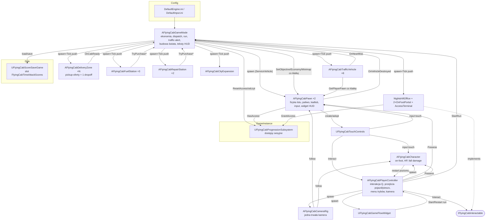
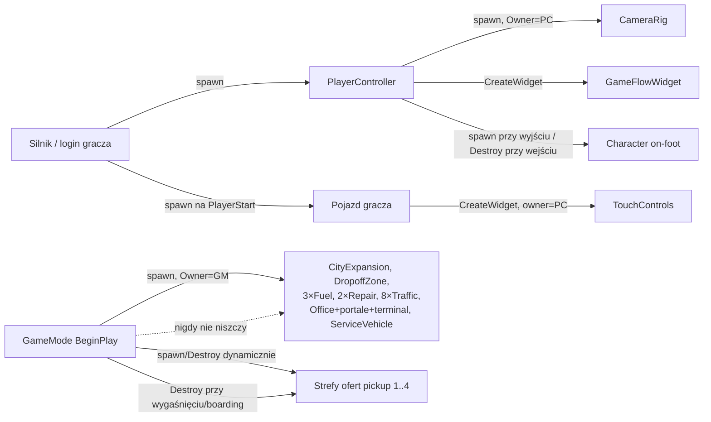
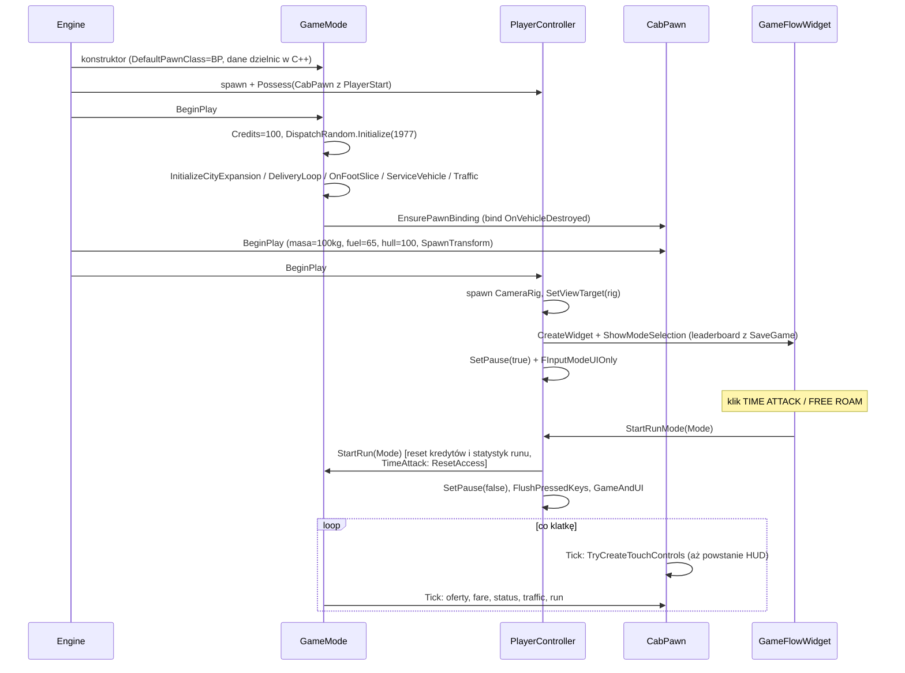
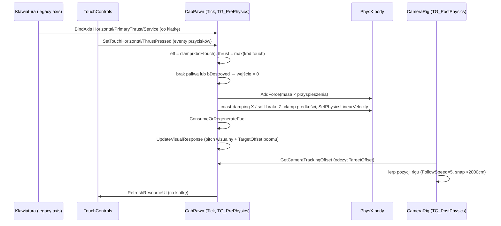
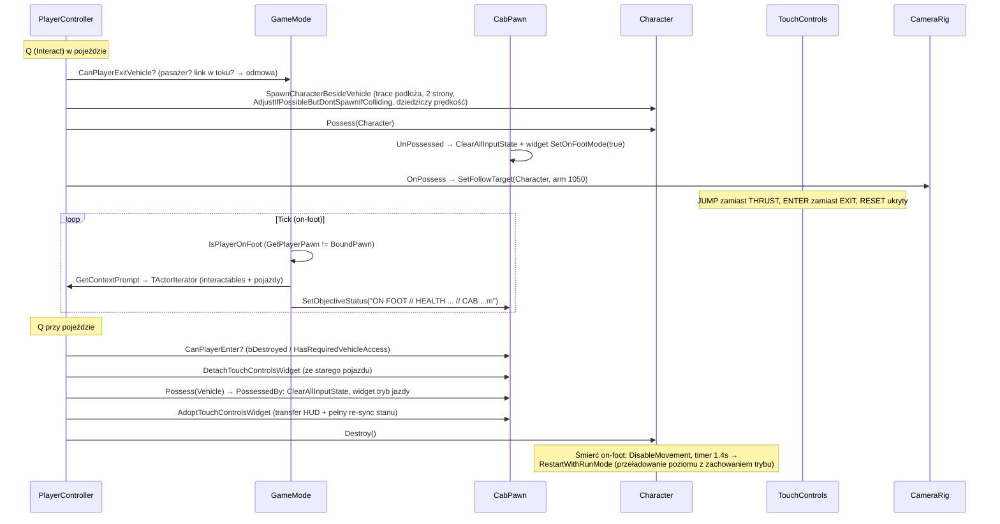
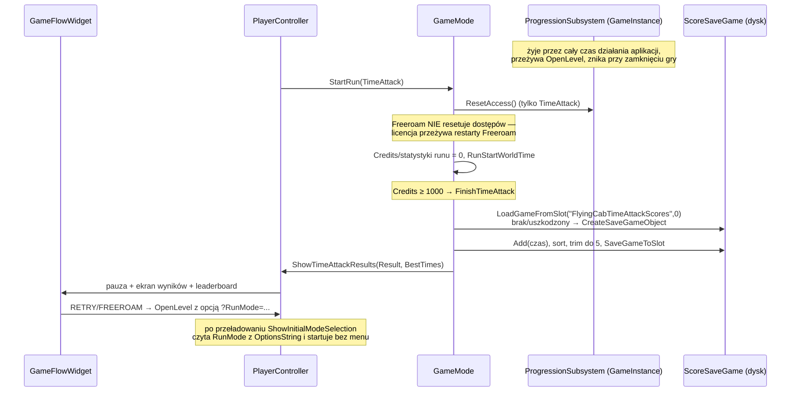

# Audyt architektury — unreal/FlyingCabFlightLab

Data: 2026-08-10 · Tryb: read-only, working tree · Autor: audyt architektoniczny (Claude) · Odbiorca poprawek: Codex GPT

Wszystkie ścieżki w dowodach są względne wobec `unreal/FlyingCabFlightLab/`, chyba że zaczynają się od `scripts/` (referencja Godot) lub `Config/`. Numery linii odnoszą się do aktualnego working tree.

---

## 1. Stan working tree i zakres audytu

Potwierdzone fakty:

- Gałąź: `main`. Ostatni commit: `76edf89` z 2026-07-29, opis „initializing". Working tree jest **daleko przed ostatnim commitem**: 14 plików zmodyfikowanych (m.in. `FlyingCabGameMode.cpp` +945 linii wg `git diff --stat`, `FlyingCabPawn.cpp` +451, `FlyingCabTouchControls.cpp` +268) oraz **22 nieśledzone pliki źródłowe** — cały wątek on-foot (`FlyingCabCharacter`, `FlyingCabPlayerController`, `FlyingCabCameraRig`, portale, terminal, biuro), progresja (`FlyingCabProgressionSubsystem`), save (`FlyingCabScoreSaveGame`), run mode (`FlyingCabRunTypes.h`, `FlyingCabGameFlowWidget`) i rozbudowa miasta (`FlyingCabCityExpansion`) istnieją wyłącznie jako pliki nieśledzone.
- Audyt objął aktualny working tree (nie stan ostatniego commitu). Lokalnych zmian nie oceniano jako błędów; są traktowane jako bieżąca implementacja.
- Silnik: Unreal Engine **5.8** (`FlyingCabFlightLab.uproject:3`), jeden moduł runtime `FlyingCabFlightLab` (`FlyingCabFlightLab.uproject:6-12`), target `BuildSettingsVersion.V7` / `Unreal5_8` (`Source/FlyingCabFlightLab.Target.cs:11-12`).
- Zależności modułu: Public `Core, CoreUObject, Engine, InputCore, EnhancedInput`; Private `UMG, Slate, SlateCore` (`Source/FlyingCabFlightLab/FlyingCabFlightLab.Build.cs:11-13`).
- Target sprzętowy: `TargetedHardwareClass=Mobile` (`Config/DefaultEngine.ini:250`), Android `Orientation=Portrait` (`Config/DefaultEngine.ini:264`), iOS wyłącznie portrait (`Config/DefaultEngine.ini:266-270`).
- Mapa startowa i domyślna: `/Game/Maps/FlightLab` (`Config/DefaultEngine.ini:4,14`), globalny GameMode: `/Script/FlyingCabFlightLab.FlyingCabGameMode` (`Config/DefaultEngine.ini:16`). `GameInstanceClass` pozostaje silnikowy (`Config/DefaultEngine.ini:13`) — wystarcza, bo progresja siedzi w `UGameInstanceSubsystem`.
- Content zawiera dokładnie 2 assety: `Content/Blueprints/BP_FlyingCabPawn.uasset` i `Content/Maps/FlightLab.umap`. Brak assetów Enhanced Input (brak `InputAction`/`InputMappingContext`).
- Kod źródłowy: 7 929 linii łącznie; największe pliki: `FlyingCabGameMode.cpp` (1 355), `FlyingCabPawn.cpp` (1 139), `FlyingCabTouchControls.cpp` (819), `FlyingCabPlayerController.cpp` (530).

Uwaga procesowa (nie błąd kodu): ~5–6 tys. linii nowej funkcjonalności nie jest zabezpieczone żadnym commitem. Pojedyncza awaria dysku/omyłkowy `git clean` usuwa cały etap on-foot/progresja/time-attack. Rekomendacja: commit przed rozpoczęciem poprawek z tego raportu (także po to, by poprawki Codexa były diffowalne względem stanu audytowanego).

Poza zakresem: `Intermediate/`, `Binaries/`, `Saved/`, `DerivedDataCache/`, pliki generowane przez UHT, pełny audyt projektu Godot.

---

## 2. Ograniczenia audytu wynikające z `.uasset` i `.umap`

Nie interpretowano binariów. Skutki:

1. **`BP_FlyingCabPawn.uasset`** — z kodu wiadomo tylko, że: GameMode ładuje go przez `ConstructorHelpers::FClassFinder` ze sztywnej ścieżki `/Game/Blueprints/BP_FlyingCabPawn` i ustawia jako `DefaultPawnClass` z cichym fallbackiem do klasy C++ (`FlyingCabGameMode.cpp:39-47`), a `FLIGHT_FEEL_TEST.md:11-15` deklaruje, że BP służy wyłącznie do strojenia Class Defaults (kategorie `Flying Cab | Flight/Presentation/Debug`). **Nie można statycznie potwierdzić**: czy BP nie nadpisuje komponentów, nie dodaje logiki graf-owej, ani jakie ma faktyczne wartości parametrów lotu. Wszystkie wnioski o wartościach parametrów lotu w tym raporcie dotyczą defaultów C++.
2. **`FlightLab.umap`** — z kodu wynika pośrednio, że mapa zawiera: geometrię bazowej areny jako `AStaticMeshActor` (heurystyka szukająca „wschodniej ściany" po bounds — `FlyingCabCityExpansion.cpp:40-61`), oraz najprawdopodobniej `PlayerStart` (spawn pawna robi standardowy `AGameModeBase`). Mapa była lokalnie zmodyfikowana (diff binarny 59357→59512 B). **Nie można statycznie potwierdzić**: listy aktorów w mapie, ustawień świateł/postprocess, pozycji PlayerStart, ani czy w mapie nie ma dodatkowych instancji klas projektu.
3. Wszystkie zależności krytyczne dla rozgrywki poza powyższymi dwoma są w C++ i konfiguracji — to duża zaleta audytowalności obecnej architektury.

Rzeczy wymagające ręcznego sprawdzenia w Unreal Editor zebrano w sekcji 22.

---

## 3. Executive summary (12 wniosków)

1. **Architektura faktyczna = „GameMode jako centrum świata"**: `AFlyingCabGameMode` buduje miasto, spawnuje strefy/stacje/ruch/pojazd serwisowy/biuro, prowadzi dispatch pasażerów, ekonomię, opłatę za kurs, ostrzeżenia o ruchu, tryb runu, save wyników i komponuje teksty HUD — wszystko sterowane z jednego `Tick` (`FlyingCabGameMode.cpp:87-98,300-310`). Na etapie prototypu spójne, ale to już jest god object z ~10 odpowiedzialnościami (sekcja 12.1).
2. **Własność stanu jest w większości jednoznaczna i dobrze rozdzielona** (kredyty/kurs — GameMode; paliwo/kadłub — Pawn; zdrowie — Character; dostępy — GameInstanceSubsystem; leaderboard — SaveGame). Wyjątek: stan HUD jest potrójnie kopiowany (GameMode → Pawn `Display*` → Widget `Pending*`), a pozycje dzielnic/stacji są zduplikowane w 3 miejscach kodu (sekcja 13, ustalenie F-07).
3. **Model „jeden BoundPawn"** w GameMode pęka po dodaniu drugiego pojazdu (ServiceVehicle): `EnsurePawnBinding` przepina delegat `OnVehicleDestroyed` na aktualnie posiadany pojazd i **odpina go od poprzedniego** (`FlyingCabGameMode.cpp:478-487`), więc zniszczenie nie-bindowanego pojazdu nie ma obsługi (brak holowania, wieczny wrak) — ryzyko statyczne, średnia pewność (F-02).
4. **Cała komunikacja UX poza widgetem HUD idzie przez `AddOnScreenDebugMessage`** (komunikaty interakcji, IMPACT, tow, PASSENGER SECURED — `FlyingCabPlayerController.cpp:522-530`, `FlyingCabGameMode.cpp:757-763,929-938`). W buildzie Shipping (cel: mobile) te komunikaty nie istnieją — gracz nie zobaczy m.in. powodu odmowy wyjścia z pojazdu (F-01).
5. **Input jest w praktyce w 100% legacy** (`AxisMappings`/`ActionMappings` + `BindAxis/BindAction`), działa tylko dzięki kompatybilności `EnhancedPlayerInput` (`Config/DefaultInput.ini:61-72,91-92`; `FlyingCabPawn.cpp:235-255`). Deklarowany `EnhancedInput` nie jest używany (zero assetów IMC/IA, zero `AddMappingContext`). Spójne, ale sprzeczne z deklaracją i oparte o ścieżkę przestarzałą w UE5 (F-05).
6. **Higiena inputu jest mocną stroną**: neutralizacja przy possess/unpossess/reset/destroy (`FlyingCabPawn.cpp:257-277,294-296,1014`), `FlushPressedKeys` przy menu i przejściach (`FlyingCabPlayerController.cpp:87,130,172`), `bShouldFlushPressedKeysOnViewportFocusLost=True` (`Config/DefaultInput.ini:82`), widget zwalnia wejścia na focus-lost/mouse-leave/unhover (`FlyingCabTouchControls.cpp:42-52,540-553`). Pokrywa to wprost testy 6–7 z `FLIGHT_FEEL_TEST.md`.
7. **Pętla kursu taxi jest kompletna i domknięta** (oferty z czasem życia → curbside link 0,65 s → fare licząca zbliżanie/oddalanie z podłogą `BaseFare` → curbside exit 0,55 s → wypłata → dispatcher z `FRandomStream`), z jednym właścicielem przepływu (GameMode) i zdarzeniami stref przez delegat `OnCabReady` (sekcja 8).
8. **Wydajność mobilna ma trzy konkretne, mierzalne ryzyka**: (a) skan całego świata `TActorIterator<AActor>` co klatkę w trybie on-foot przez `GetContextPrompt` (F-03), (b) rekonstrukcja i `SetText` tekstów HUD co klatkę (F-08), (c) ~25–30 ruchomych `PointLight` + MobileHDR + MSAA×4 przy `r.Mobile.Forward.EnableLocalLights=1` (F-09). Wszystkie z planem pomiaru, nie przedstawiam ich jako wyników profilera.
9. **Save/progresja są minimalne i świadomie rozwarstwione**: sesyjne dostępy w `UFlyingCabProgressionSubsystem` (przeżywają `OpenLevel`, reset tylko przy starcie Time Attack — `FlyingCabGameMode.cpp:122-131`), trwały tylko leaderboard Time Attack (`FlyingCabScoreSaveGame`). Brak wersjonowania zapisu i brak zapisu stanu gry (Godot miał pełny SaveManager) — do decyzji produktowej, nie automatyczny błąd (sekcja 19).
10. **Granica C++/Blueprint jest wzorowo wąska**: BP tylko jako nośnik tuningu parametrów pawna; cała logika, UI (widgety budowane w C++ przez `WidgetTree`) i geometria rozszerzenia miasta w kodzie. Koszt: współrzędne świata i teksty na sztywno w C++ (sekcja 16).
11. **Zależność od mapy jest jednym kruchym punktem**: `CityExpansion` wyszukuje ścianę graniczną po heurystyce bounds (±350 cm wokół X=4950), z fallbackiem po labelu tylko `WITH_EDITOR` (`FlyingCabCityExpansion.cpp:51-57`) — edycja mapy może cicho wyłączyć wschodnią część miasta (F-06).
12. **`FLIGHT_FEEL_TEST.md` częściowo rozjechał się z kodem**: opisuje 6 dzielnic (jest 10 — `FlyingCabGameMode.cpp:49-70`), telemetryczny „Input reset guard WAITING/READY" (w kodzie tylko licznik `ForcedInputResetCount` — `FlyingCabPawn.cpp:692,1047`), brak sekcji o on-foot, terminalu, trybach runu i drugiej stacji napraw (F-13).

---

## 4. Faktyczna architektura runtime Unreal

### 4.1 Entry point

Łańcuch startu: `FlightLab.umap` (GameDefaultMap, `Config/DefaultEngine.ini:14`) → `AFlyingCabGameMode` (GlobalDefaultGameMode, `Config/DefaultEngine.ini:16`). Konstruktor GameMode ustawia `DefaultPawnClass` na `BP_FlyingCabPawn` (fallback: `AFlyingCabPawn`) i `PlayerControllerClass = AFlyingCabPlayerController` (`FlyingCabGameMode.cpp:35-47`). Silnik spawnuje PC i pawna na PlayerStart (standardowy login `AGameModeBase`). GameInstance jest silnikowy; `UFlyingCabProgressionSubsystem` rejestruje się automatycznie jako `UGameInstanceSubsystem`.

### 4.2 Kto tworzy i posiada co

| Obiekt | Tworzy | Owner (`SpawnParameters.Owner`) | Referencję trzyma |
|---|---|---|---|
| Pojazd gracza (BP_FlyingCabPawn) | silnik (RestartPlayer) | — | GameMode `BoundPawn` (`FlyingCabGameMode.h:211-212`), PC `ActiveVehicle` (`FlyingCabPlayerController.h:74-75`) |
| Pojazd serwisowy (drugi AFlyingCabPawn) | GameMode `InitializeServiceVehicle` (`FlyingCabGameMode.cpp:254-298`) | GameMode | GameMode `ServiceVehicle` |
| Postać on-foot (AFlyingCabCharacter) | PC `SpawnCharacterBesideVehicle` (`FlyingCabPlayerController.cpp:448-520`) | PC | nikt na stałe (niszczona przy wejściu do pojazdu, `FlyingCabPlayerController.cpp:356`) |
| PlayerController | silnik | — | — |
| CameraRig (jedna trwała kamera) | PC `BeginPlay` (`FlyingCabPlayerController.cpp:37-44`) | PC | PC `CameraRig` |
| HUD/touch (UFlyingCabTouchControls) | **Pawn** `TryCreateTouchControls` (ponawiane w Tick — `FlyingCabPawn.cpp:174-178,721-763`) | PC (OwningPlayer) | Pawn `TouchControlsWidget` (`FlyingCabPawn.h:166-167`); przenoszony między pojazdami przez PC (`FlyingCabPlayerController.cpp:351-355`) |
| Ekran trybów/wyników (UFlyingCabGameFlowWidget) | PC (`FlyingCabPlayerController.cpp:117-124,139-145`) | PC | PC `GameFlowWidget` |
| Strefy pickup (oferty) | GameMode `SpawnPassengerOffer` (`FlyingCabGameMode.cpp:526-611`) | GameMode | GameMode `PassengerOffers[].Zone` |
| Strefa dropoff (jedna, przenoszona) | GameMode `InitializeDeliveryLoop` (`FlyingCabGameMode.cpp:324-328`) | GameMode | GameMode `DropoffZone` |
| Stacje paliw ×3 / napraw ×2 | GameMode (`FlyingCabGameMode.cpp:329-362`) | GameMode | GameMode `FuelStations/RepairStations` |
| Ruch uliczny ×8 | GameMode `InitializeTraffic` (`FlyingCabGameMode.cpp:410-449`) | GameMode | GameMode `TrafficVehicles` |
| Miasto wschodnie (geometria) | GameMode → `AFlyingCabCityExpansion` (komponenty runtime — `FlyingCabCityExpansion.cpp:135-167`) | GameMode | GameMode `CityExpansion` |
| Biuro Nightshift + 2 portale + terminal | GameMode `InitializeOnFootSlice` (`FlyingCabGameMode.cpp:196-252`) | GameMode | GameMode (`NightshiftOffice/Entrance/Exit/ServiceAccessTerminal`) |
| Progresja (dostępy) | silnik (GameInstanceSubsystem) | GameInstance | dostęp przez `GetSubsystem` (Pawn, terminal, GameMode) |
| Zapis leaderboardu | GameMode `SaveTimeAttackScore` (`FlyingCabGameMode.cpp:1308-1346`) | — (slot na dysku) | ładowany ad hoc |

**W mapie umieszczone są tylko**: geometria bazowej areny (StaticMeshActors) i PlayerStart (wniosek pośredni). **Wszystko inne jest tworzone dynamicznie w BeginPlay** — mapa jest niemal pusta logicznie, co czyni projekt przenośnym, ale przenosi konfigurację świata do C++ (sekcja 16).

### 4.3 Komunikacja między klasami

- **Delegaty natywne (3)**: `FOnFlyingCabZoneReady OnCabReady` (strefa→GameMode, `FlyingCabDeliveryZone.h:51`), `FOnFlyingCabDestroyed OnVehicleDestroyed` (Pawn→GameMode, `FlyingCabPawn.h:97`), `FOnFlyingCabNearMiss OnNearMiss` (traffic→GameMode, `FlyingCabTrafficVehicle.h:39`). Wiązane `AddUObject`, zdejmowane `RemoveAll` przy przepięciu/usunięciu (`FlyingCabGameMode.cpp:480,624`).
- **Push co klatkę (GameMode→Pawn→Widget)**: `SetObjectiveStatus/SetEconomyStatus/SetTrafficAlert/SetMinimapState/SetProximityGuidance/SetTimeAttackStatus` wołane z `Tick` GameMode (`FlyingCabGameMode.cpp:300-310,966-1134`), Pawn forwarduje do widgetu (`FlyingCabPawn.cpp:333-458`). Brak delegatów w stronę UI — czysty polling/push.
- **Wyszukiwanie aktorów**: `UGameplayStatics::GetPlayerPawn(0)` co klatkę w GameMode (`FlyingCabGameMode.cpp:466`) i w każdym z 8 pojazdów ruchu (`FlyingCabTrafficVehicle.cpp:132`); `TActorIterator` w PC przy interakcji i — pośrednio — co klatkę w trybie on-foot (`FlyingCabPlayerController.cpp:390-446` wywoływane z `FlyingCabGameMode.cpp:1018-1022`).
- **Bezpośrednie wywołania w górę**: stacje wołają `GetAuthGameMode->TryPurchaseFuel/Repair` (`FlyingCabFuelStation.cpp:159-162`, `FlyingCabRepairStation.cpp:161-164`); widgety wołają PC/Pawn przez `GetOwningPlayer(Pawn)` (`FlyingCabTouchControls.cpp:683-691,794-801`; `FlyingCabGameFlowWidget.cpp:235-271`); Character woła PC przy śmierci (`FlyingCabCharacter.cpp:355-368`).
- **Interfejs**: `IFlyingCabInteractable` (portale, terminal) konsumowany wyłącznie przez PC (`FlyingCabPlayerController.cpp:390-417`; `FlyingCabInteractable.h:18-25`).
- **Subsystem**: dostępy przez `GetSubsystem<UFlyingCabProgressionSubsystem>` w Pawn (`FlyingCabPawn.cpp:828-840`), terminalu (`FlyingCabAccessTerminal.cpp:90-105`) i GameMode (`FlyingCabGameMode.cpp:124-131`).

### 4.4 Granica C++ / Blueprint

Jedyny Blueprint (`BP_FlyingCabPawn`) pełni rolę **kontenera Class Defaults** dla ~25 `UPROPERTY(EditAnywhere)` pawna (`FlyingCabPawn.h:169-268`); procedura strojenia opisana w `FLIGHT_FEEL_TEST.md:9-15`. Ładowany po sztywnej ścieżce z cichym fallbackiem (`FlyingCabGameMode.cpp:39-47`) — literówka w ścieżce po przeniesieniu assetu nie zatrzyma gry, tylko po cichu zresetuje tuning do defaultów C++ (jest log klasy pawna w BeginPlay, `FlyingCabPawn.cpp:149-155`, co łagodzi ryzyko). UI nie ma żadnych assetów WBP — drzewa widgetów budowane w `RebuildWidget/BuildWidgetTree` (`FlyingCabTouchControls.cpp:26-34,247-566`; `FlyingCabGameFlowWidget.cpp:40-47,102-196`).

---

## 5. Diagram komponentów i własności

### 5.1 Komponenty i kierunki zależności (stan obecny)



### 5.2 Własność obiektów (kto tworzy / kto niszczy)



Obiekty niszczone w trakcie gry: wyłącznie strefy ofert (`FlyingCabGameMode.cpp:613-639`) i postać on-foot (`FlyingCabPlayerController.cpp:356`). Reszta żyje do końca poziomu.

---

## 6. Sekwencja startu rozgrywki



Dowody: `FlyingCabGameMode.cpp:35-98,100-154`; `FlyingCabPlayerController.cpp:33-65,137-176`; `FlyingCabPawn.cpp:138-160,174-178`. Uwaga: kolejność `BeginPlay` GameMode↔PC nie jest kontraktowo gwarantowana; obecny kod jest na nią odporny (PC czyta z GameMode tylko pola ustawiane w konstruktorze/StartRun), ale to niejawne założenie — patrz sekcja 14.

## 7. Sekwencja lotu i inputu



Dowody: `FlyingCabPawn.cpp:174-233` (Tick), `:1131-1139` (fuzja wejść), `:894-937` (paliwo), `:1081-1129` (prezentacja), `FlyingCabCameraRig.cpp:33-53,65-82`. Reset `R`: `ResetVehicle` czyści wejścia (z `FlushPressedKeys`), przywraca fuel/hull/pozycję, **nie dotyka** kredytów ani kursu (`FlyingCabPawn.cpp:294-331`) — zgodnie z `FLIGHT_FEEL_TEST.md:119`.

## 8. Sekwencja kursu taxi

```mermaid
sequenceDiagram
    participant GM as GameMode
    participant PZ as Strefa pickup (oferta)
    participant DZ as DropoffZone
    participant Pawn as CabPawn
    Note over GM: Tick: UpdatePassengerOffers<br/>spawn ofert (1..4, seed 1977), odliczanie lifetime
    GM->>PZ: spawn + Configure(Pickup, 180cm/s, 0.65s) + OnCabReady bind
    Pawn->>PZ: wlot + zwolnienie ≤180 cm/s
    PZ->>PZ: CapturePassengerPath, link 0..100% (pasażer sunie do auta)
    Note over PZ: wyjazd/przyspieszenie → ResetConfirmation (link od zera)
    PZ->>GM: OnCabReady (link ukończony)
    GM->>GM: bPassengerOnBoard=true, ActiveFare=BaseFare(20), FareLastDistance
    GM->>DZ: SetActorLocation(cel) + SetZoneActive(true)
    GM->>PZ: RemovePassengerOfferAt("boarded") → Destroy
    GM->>GM: SetPassengerOfferAcceptance(false) dla reszty ofert
    loop Tick z pasażerem
        GM->>GM: UpdateActiveFare (+1.10/m zbliżenia, −50% za oddalanie, min=BaseFare)
    end
    Pawn->>DZ: stop ≤180 cm/s → EXIT 0..100% (0.55s)
    DZ->>GM: OnCabReady
    GM->>GM: Credits += fare, CompletedDeliveries++, statystyki runu
    GM->>DZ: SetZoneActive(false); akceptacja ofert wraca
    Note over GM: nowe oferty pojawiają się z countdownu —<br/>brak osobnej fazy „dispatch scanning"
    Note over GM: Zniszczenie w trakcie kursu → HandleVehicleDestroyed:<br/>kurs anulowany, fare=0, tow do 35 CR, recovery po 2.5s,<br/>oferty zablokowane do czasu recovery
```

Dowody: `FlyingCabGameMode.cpp:490-611` (oferty), `FlyingCabDeliveryZone.cpp:116-175` (link/exit), `FlyingCabGameMode.cpp:729-814` (boarding/wypłata), `:703-727` (fare), `:903-964` (zniszczenie/holowanie). Kontrakt zachowań zgodny z `FLIGHT_FEEL_TEST.md` sekcje 8, 10–12, 14–15, z tą różnicą, że komunikaty `DISPATCH // SCANNING` i `NEW CURBSIDE CALL` z testu 15 nie występują już w kodzie (model przeszedł z pojedynczego zlecenia na rynek ofert) — patrz F-13.

## 9. Sekwencja vehicle ↔ on-foot



Dowody: `FlyingCabPlayerController.cpp:234-366,448-520`; `FlyingCabPawn.cpp:257-277,527-576`; `FlyingCabCameraRig.cpp:55-89`; `FlyingCabGameMode.cpp:698-701,1000-1042`; `FlyingCabCharacter.cpp:326-375`.

## 10. Sekwencja save/load i progresji



Dowody: `FlyingCabGameMode.cpp:100-154,156-178,1256-1346`; `FlyingCabPlayerController.cpp:91-102,113-168`; `FlyingCabProgressionSubsystem.cpp:7-28`; `FlyingCabScoreSaveGame.h:16-17`. Poza leaderboardem **nic nie jest trwałe**: kredyty, paliwo, kadłub, dostępy i postęp znikają przy zamknięciu aplikacji.

---

## 11. Macierz właścicieli stanu

| Stan | Właściciel (źródło prawdy) | Kopie/odbiorcy | Kto resetuje | Przeżywa reset `R` | Przeżywa zniszczenie+tow | Przeżywa zmianę trybu (on-foot) | Przeżywa śmierć on-foot (reload) | Przeżywa restart aplikacji |
|---|---|---|---|---|---|---|---|---|
| Kredyty | `GameMode.Credits` (`FlyingCabGameMode.h:222`) | Pawn `DisplayCredits` → widget `PendingCredits` | `StartRun` (`FlyingCabGameMode.cpp:110`) | TAK | TAK (minus tow) | TAK | NIE (StartRun po reloadzie) | NIE |
| Aktywny kurs (pasażer, indeksy) | `GameMode.bPassengerOnBoard/CurrentPickup/DropoffIndex` (`FlyingCabGameMode.h:217-240`) | strefy (wizualnie) | dropoff, `HandleVehicleDestroyed` | TAK (`FLIGHT_FEEL_TEST.md:119`) | NIE (anulowany) | zmiana blokowana przy pasażerze (`FlyingCabGameMode.cpp:674-696`) | NIE | NIE |
| Opłata (fare) | `GameMode.ActiveFare/FareLastDistance` (`FlyingCabGameMode.h:236-237`) | Pawn `DisplayActiveFare` → widget | wypłata / zniszczenie | TAK | NIE | n/d | NIE | NIE |
| Liczba dostaw | `GameMode.CompletedDeliveries` (`FlyingCabGameMode.h:221`) | teksty HUD | nigdy w sesji poziomu | TAK | TAK | TAK | NIE | NIE |
| Statystyki runu / tryb runu | `GameMode.Run* / CurrentRunMode` (`FlyingCabGameMode.h:223-235`) | widget TimeAttack panel | `StartRun` | TAK | TAK (tow zliczany) | TAK | tryb TAK (opcja URL), statystyki NIE | NIE |
| Paliwo | `Pawn.CurrentFuel` (`FlyingCabPawn.h:286`) | widget (procent) | `ResetVehicle` (65), `RecoverVehicle` (≥25%) | NIE (=65) | NIE (≥25%) | TAK (pawn trwa) | NIE | NIE |
| Kadłub | `Pawn.CurrentHull` (`FlyingCabPawn.h:287`) | widget | `ResetVehicle`, `RecoverVehicle` (=100) | NIE (=100) | NIE (=100) | TAK | NIE | NIE |
| bDestroyed | `Pawn.bDestroyed` (`FlyingCabPawn.h:292`) | GameMode (odczyt), widget | `RecoverVehicle` | reset ignorowany gdy destroyed (`FlyingCabPawn.cpp:297-300`) | NIE | TAK | NIE | NIE |
| Zdrowie on-foot | `Character.CurrentHealth` (`FlyingCabCharacter.h:105`) | HUD przez GameMode | nowy spawn postaci | n/d | n/d | postać niszczona przy wejściu do auta | NIE | NIE |
| Odblokowane dostępy | `ProgressionSubsystem.GrantedAccess` (`FlyingCabProgressionSubsystem.h:27-28`) | Pawn (cache `bCachedAccessState`), terminal | `ResetAccess` tylko TimeAttack (`FlyingCabGameMode.cpp:122-131`) | TAK | TAK | TAK | **TAK** (subsystem przeżywa OpenLevel) | NIE |
| Bieżący tryb gracza (pojazd/pieszo) | pochodna: `GetPlayerPawn` vs `BoundPawn` (`FlyingCabGameMode.cpp:698-701`) — brak jawnego pola | HUD (tryb widgetu) | possession | — | — | — | — | — |
| Leaderboard Time Attack | slot `FlyingCabTimeAttackScores` (`FlyingCabGameMode.cpp:31`) | menu/wyniki | nigdy (brak kasowania) | TAK | TAK | TAK | TAK | **TAK** |
| Stan wejść | `Pawn.Keyboard*/Touch*` + `TouchControls.b*Pressed` + `PlayerInput` | — | `ClearAllInputState` + `FlushPressedKeys` + `ReleaseAllInputs` | zerowane | zerowane | zerowane | zerowane | n/d |
| SpawnTransform pojazdu | `Pawn.SpawnTransform` z BeginPlay (`FlyingCabPawn.cpp:144`) | — | nigdy | punkt odniesienia resetu | punkt odniesienia holowania | TAK | NIE | NIE |

Wielu modyfikatorów tego samego stanu (miejsca do pilnowania): `Credits` piszą 4 ścieżki, wszystkie wewnątrz GameMode (dropoff, near-miss, TryPurchaseFuel/Repair, tow) — spójne; `CurrentFuel/Hull` piszą Pawn (Tick/reset/recover) i GameMode pośrednio przez `AddFuel/AddHull` — spójne, bo mutacja zawsze w metodach Pawna; **stan HUD** pisany jest z GameMode i z Pawna równolegle (`SetEconomyStatus` wołane i z Tick GameMode, i z TryPurchase*) — nadmiarowe, ale bez konfliktu wartości.

---

## 12. Ocena głównych klas

### 12.1 `AFlyingCabGameMode` — ocena „god object"

**Faktyczne odpowiedzialności (10):** (1) wybór klas gracza i ładowanie BP (`FlyingCabGameMode.cpp:35-47`); (2) budowa świata: miasto, biuro, portale, terminal, pojazd serwisowy, stacje, ruch (`:87-98,180-298,312-462`); (3) dispatch pasażerów: spawn/lifetime/akceptacja ofert (`:490-651`); (4) ekonomia: kredyty, fare, tow, zakupy paliwa/napraw (`:661-964`); (5) świadomość ruchu i near-miss (`:1136-1238`); (6) tryb runu + Time Attack + statystyki (`:100-154,1240-1306`); (7) save/load leaderboardu (`:156-178,1308-1346`); (8) komponowanie tekstów HUD i minimapy co klatkę (`:966-1134`); (9) polityka wyjścia z pojazdu (`:674-696`); (10) bindowanie pawna przez polling (`:464-488`).

- **Stan:** cały stan ekonomii/kursu/runu (`FlyingCabGameMode.h:217-241`) + referencje do wszystkiego, co spawnuje (`:178-215`).
- **Tick:** tak — 6 poddziałań co klatkę (`FlyingCabGameMode.cpp:300-310`); żadne nie jest gate'owane stanem (np. `UpdateTrafficAwareness` liczy predykcję także gdy nie ma zagrożeń).
- **Delegaty:** odbiorca `OnCabReady`, `OnVehicleDestroyed`, `OnNearMiss`; poprawnie zdejmowane (`:480,624`).
- **Timery:** `RecoveryTimerHandle` — `ClearTimer` przed `SetTimer` (`:945-951`); brak czyszczenia w `EndPlay`, ale GameMode ginie razem ze światem — akceptowalne.
- **Sprzężenie:** zna typy konkretne 10 klas projektu; nikt poza PC/stacjami nie woła GameMode — sprzężenie jest gwiazdą z GameMode w centrum.
- **Testowalność:** niska — logika fare/dispatch/tow nierozdzielna od spawnu aktorów i `GetWorld()`. Wyjątek: `CalculateEstimatedFare` i polityki zakupów są czyste obliczeniowo, ale prywatne.

**Które odpowiedzialności są naturalnie sklejone, a które rozdzielić:** (2) budowa świata jest jednorazowa i niezależna od (3)–(8) — najłatwiejsza do wyjęcia (np. `AFlyingCabWorldBootstrapper` albo pozostawienie aktorów w mapie). (3)+(4) dispatch i fare są sprzężone przez `bPassengerOnBoard` — wydzielać razem jako `UFlyingCabDispatchComponent` (na GameMode). (5) traffic-awareness zależy tylko od `BoundPawn` i listy pojazdów — czysty kandydat na komponent. (6)+(7) run+save — spójna para (`UFlyingCabRunSubsystem` lub komponent). (8) komponowanie tekstów HUD powinno zejść do warstwy UI (widget subskrybuje stan, nie odwrotnie). Kolejność wyjmowania bez dużej przebudowy: 8 → 5 → 2 → 3+4 → 6+7 (sekcja 21, Etap 3).

Werdykt: jeszcze nie patologiczny (prototyp, 1 355 linii, spójny styl), ale każda kolejna mechanika dopisana do `Tick` GameMode zwiększa koszt wyjścia. Granicę bólu wyznaczy pierwsza funkcja wymagająca drugiego świata/poziomu.

### 12.2 `AFlyingCabPawn`

**Odpowiedzialności (9):** fizyka lotu (Tick, `FlyingCabPawn.cpp:174-233`), fuzja inputu klawiatura+dotyk (`:1131-1139`), paliwo (`:894-937`), obrażenia/zniszczenie (`:940-1023`), reset/holowanie (`:294-331,620-644`), tożsamość+dostępy wizualne (`:482-525,842-892`), strzałka naprowadzania (`:386-417`), telemetria F3 (`:1025-1079`), **cykl życia widgetu HUD** (`:721-763,527-576`).

- Komponenty: 10 (box, mesh, spring arm+kamera — nieużywana do renderu, 2 światła, label, root+2 meshe strzałki — `FlyingCabPawn.h:136-164`). SpringArm/Camera pawna służą dziś wyłącznie jako **nośnik danych** `TargetOffset` dla CameraRig (`FlyingCabPawn.cpp:445-448`, `FlyingCabCameraRig.cpp:73-76`) — ukryty kontrakt, patrz sekcja 13.
- Fizyka: `SetSimulatePhysics(true)` + blokady DOF do płaszczyzny X/Z (`:34-49,142-143`); Tick w `TG_PrePhysics` nadpisuje prędkość `SetPhysicsLinearVelocity` co klatkę (`:226-228`) — świadomy model arcade; clampy i coast-damping odtwarzają kontrakt z `car.gd`.
- Input: osie legacy bindowane w `SetupPlayerInputComponent` (`:235-255`); higiena wejść wzorowa (`ClearAllInputState` z `FlushPressedKeys` — `:661-709` — wołane przy possess, unpossess, reset, destroy, recover).
- Ryzyko cyklu życia: niskie — `EndPlay` sprząta widget (`:162-172`); wszystkie wskaźniki w `UPROPERTY`.
- Problem zakresu: paliwo, obrażenia i „identity/access" to gotowe komponenty (`UActorComponent`), a tworzenie/adopcja widgetu HUD nie powinno być w pawnie w ogóle (naturalny właściciel: PlayerController/HUD) — obecny „taniec" `DetachTouchControlsWidget/AdoptTouchControlsWidget` między pawnami (`FlyingCabPlayerController.cpp:351-355`) istnieje tylko dlatego, że widget mieszka w pawnie.

### 12.3 `AFlyingCabPlayerController`

Odpowiedzialności: kamera (spawn rigu, `bAutoManageActiveCameraTarget=false` — `FlyingCabPlayerController.cpp:28-31,37-62`), interakcja kontekstowa Q (`:234-256`), przejścia pojazd↔pieszo ze spawnowaniem postaci (`:282-366,448-520`), menu trybów + pauza + tryby inputu (`:137-188`), wyniki Time Attack (`:113-135`). Rozsądny zakres jak na kontroler; najbardziej wątpliwy element to **skan świata `TActorIterator<AActor>`** w `FindNearestInteractable` (`:400-416`) — akceptowalny przy interakcji na żądanie, ale wołany też co klatkę z GameMode w trybie on-foot (F-03). Dobry wzorzec: `SpawnCharacterBesideVehicle` czyta wymiary kapsuły z CDO zamiast hardkodu (`:456-465`) i używa `AdjustIfPossibleButDontSpawnIfColliding` z fallbackiem na drugą stronę pojazdu.

### 12.4 `UFlyingCabTouchControls` (HUD + sterowanie dotykowe)

- **Czy UI steruje domeną?** Tak, w trzech miejscach, wszystkie przez publiczne API: touch → `Pawn.SetTouch*` (`FlyingCabTouchControls.cpp:722-734,760-819`), RESET → `Pawn.ResetVehicle()` (`:786-792`), INTERACT → `PC.RequestContextInteraction()` (`:794-801`). Poza tym wyłącznie prezentacja. Brak modyfikacji GameMode z UI — dobrze.
- **Cykl życia:** tworzony przez pawna, transferowany przy zmianie pojazdu; `NativeDestruct/NativeOnFocusLost/NativeOnMouseLeave` zwalniają wejścia (`:36-52`). `Pending*` bufory pozwalają ustawiać stan zanim `RebuildWidget` zbuduje drzewo (`:26-34,166-188`) — solidne.
- **Odporność na zmianę pawna:** kieruje input do `GetOwningPlayerPawn()` rzutowanego na Pawn/Character (`:683-691`) — automatycznie podąża za possession; po `Possess` w trakcie trzymanego przycisku input trafi do nowego pawna, ale `SetOnFootMode` w Possess/UnPossess zwalnia wejścia (`FlyingCabPawn.cpp:261-274`), więc stan nie wisi.
- **Fokus/klawiatura:** wszystkie przyciski mają `IsFocusable=false` (`:660-662`) — spełnia wymóg `FLIGHT_FEEL_TEST.md:57` (przycisk nie kradnie fokusu klawiatury).
- **Słabości:** współrzędne minimapy (bounds świata `:22-23`, 10 pinów dzielnic `:286-296`, stacje `:319-345`) zduplikowane z GameMode (F-07); layout w stałych pikselach zakotwiczony narożnikami — zachowanie na różnych aspектach portrait wymaga testu w Editorze; multi-touch dwóch przycisków naraz jest teoretycznie wspierany przez Slate, ale niepotwierdzalny statycznie (checklista, sekcja 22).

### 12.5 `UFlyingCabGameFlowWidget`

Czysty ekran modalny: pokazuje wybór trybu/wyniki, klik → trzy metody PC (`FlyingCabGameFlowWidget.cpp:235-271`). Nie trzyma stanu domeny (tylko `bShowingResults`). Działa pod pauzą, bo Slate/UMG przetwarza input i tick niezależnie od game pause (zamiera tylko `Tick` aktorów, w tym GameMode — patrz 13.6). Jedno spostrzeżenie: tekst opisu trybu hardkoduje „1000 CR" (`:56`), podczas gdy próg jest konfigurowalny `TimeAttackTargetCredits` (`FlyingCabGameMode.h:121-122`) — rozjazd przy zmianie konfigu.

### 12.6 `UFlyingCabProgressionSubsystem` + `UFlyingCabScoreSaveGame`

- **Granice:** sesja bieżąca (kredyty/kurs — GameMode, ginie z poziomem) / progresja sesyjna (dostępy — subsystem, przeżywa OpenLevel, ginie z aplikacją) / trwałość (tylko leaderboard — dysk). Granice są jawne i skomentowane (`FlyingCabProgressionSubsystem.h:9`, `FlyingCabScoreSaveGame.h:9`).
- **Inicjalizacja:** automatyczna z GameInstance — brak zależności od kolejności BeginPlay. Dobre.
- **Deterministyczny reset:** `ResetAccess()` tylko przy starcie Time Attack (`FlyingCabGameMode.cpp:122-131`) — świadoma asymetria wobec Freeroam (licencja przeżywa restart Freeroam). Wymaga jednej linii dokumentacji, bo wygląda na przypadek.
- **Wersjonowanie/uszkodzenie zapisu:** brak pola wersji w `FFlyingCabScoreSaveGame` (`FlyingCabScoreSaveGame.h:16-17`); uszkodzony/nieładowalny slot → `LoadGameFromSlot` zwraca null → tworzony świeży obiekt (`FlyingCabGameMode.cpp:1315-1330`) — degradacja łagodna (utrata leaderboardu bez crasha), migracja niemożliwa. Przy tak małym zapisie to P3, ale wzorzec trzeba poprawić **zanim** powstanie właściwy save stanu gry.
- **Synchronizacja z UI:** wyniki i leaderboard przechodzą przez PC → widget przy zdarzeniu (nie polling) — dobrze.

### 12.7 Klasy pomocnicze (skrót)

- `AFlyingCabDeliveryZone` — wzorowo samowystarczalna: tick tylko gdy aktywna (`SetActorTickEnabled` — `FlyingCabDeliveryZone.cpp:239`), kolizja wyłączana z akceptacją (`:212-233`), stan potwierdzania resetowany przy wyjeździe/przyspieszeniu (`:150-154`). Detekcja przez `GetOverlappingActors` co klatkę zamiast eventów overlap — drobny koszt.
- `AFlyingCabFuelStation`/`AFlyingCabRepairStation` — bliźniacze (kandydat na wspólną bazę); `TWeakObjectPtr ContextPawn` + sprzątanie w `EndPlay` (`FlyingCabFuelStation.cpp:178-191`) — poprawne; tickują zawsze, nawet bez pojazdu w pobliżu.
- `AFlyingCabTrafficVehicle` — ruch kinematyczny sweep+teleport na końcu pasa (`FlyingCabTrafficVehicle.cpp:87-133`); near-miss jako maszyna stanów spotkania z inwalidacją przy kontakcie (`:135-212`) — logika dobra; `GetPlayerPawn` co tick w każdym z 8 aut to wzorzec ukrytego singletona.
- `AFlyingCabCameraRig` — 89 linii, jedna odpowiedzialność, komentarz wprost mapuje na `scripts/CameraController.gd` (`FlyingCabCameraRig.cpp:50`). Wzorowa migracja mechaniki.
- `AFlyingCabCharacter` — spójny mini-pawn; uwaga: timer restartu poziomu nie jest czyszczony w EndPlay (`FlyingCabCharacter.cpp:347-352`), bezpieczny tylko dzięki słabemu bindowi delegatu timera (nie odpali na zniszczonym aktorze); ścieżka „martwy → wejście do pojazdu" jest zablokowana (`FlyingCabPlayerController.cpp:326`), więc wyścig timer-vs-Destroy dziś nie występuje.
- `AFlyingCabCityExpansion` / `AFlyingCabNightshiftOffice` — geometria z kodu; wyszukiwanie ściany granicznej po bounds — F-06.

---

## 13. Sprzężenia i ukryte kontrakty

1. **`Pawn.CameraBoom.TargetOffset` jako kanał danych do CameraRig** — pawn ma nieużywaną renderingowo kamerę, której boom przenosi look-ahead do rigu (`FlyingCabPawn.cpp:1124-1128` zapis, `FlyingCabCameraRig.cpp:73-76` odczyt). Nigdzie nieudokumentowane; usunięcie „martwej" kamery z pawna zepsułoby kamerę gry.
2. **Minimapa zna świat na sztywno** — bounds `(-5000..15000, 0..6500)` i wszystkie piny zduplikowane względem `DeliveryStops`/stacji GameMode (`FlyingCabTouchControls.cpp:22-23,286-296,319-345` vs `FlyingCabGameMode.cpp:49-84`) oraz względem platform budowanych przez CityExpansion (`FlyingCabCityExpansion.cpp:112-115`). Trzy źródła „prawdy" o topografii miasta.
3. **`EnsurePawnBinding` = polling zamiast `OnPossess`** — GameMode odkrywa zmianę pojazdu przez porównanie `GetPlayerPawn(0)` z cache co klatkę (`FlyingCabGameMode.cpp:464-488`), z celowym wyjątkiem „character ≠ rebind" opartym o failure rzutowania (komentarz `:469-471`). Kontrakt kruchy: każdy nowy typ pawna (np. drugi model pojazdu innej klasy) wymaga pamiętania o tym miejscu.
4. **`IsPlayerOnFoot` zależny od kolejności wewnątrz Tick** — poprawność `GetPlayerPawn != BoundPawn` (`:698-701`) wymaga, by `EnsurePawnBinding` wykonał się wcześniej w tej samej klatce (`:303`). Działa, ale to niezapisany invariant.
5. **Stacje wymagają GameMode konkretnego typu** — `GetAuthGameMode<AFlyingCabGameMode>` w Tick (`FlyingCabFuelStation.cpp:159`); test stacji w izolacji niemożliwy bez pełnego GameMode.
6. **`GameFlowWidget` a pauza** — sterowanie działa, bo UMG obsługuje input pod `SetPause(true)`; ale `GameMode.Tick` nie biegnie pod pauzą, więc np. `UpdateRunModeStatus` zamiera — dziś bez skutków, jutro łatwo o bug „HUD nie odświeża się w menu".
7. **Teleport portali a kamera** — portal teleportuje postać (`FlyingCabOnFootPortal.cpp:95-100`), a rig maskuje skok dystansu progiem `TeleportSnapDistance=2000` (`FlyingCabCameraRig.cpp:43-48`); odległość biuro–miasto (~22 500 cm — `FlyingCabGameMode.h:158-164`) musi pozostać > progu, inaczej kamera „przejedzie" przez świat.
8. **Komunikaty ekranowe po kluczach magicznych** — pięć stałych `0xFCAB0001..0006` rozsianych po plikach (`FlyingCabPawn.cpp:27`, `FlyingCabGameMode.cpp:28-30`, `FlyingCabPlayerController.cpp:25`, `FlyingCabCharacter.cpp:24`) tworzy niejawny, współdzielony „kanał" HUD bez wspólnej definicji.
9. **`FLIGHT_FEEL_TEST.md` jako kontrakt akceptacyjny** — kod spełnia sekcje 1–14 i 16–19 w bieżącym kształcie, ale sekcja 15 (komunikaty dispatchera) i opis telemetrii guard (56–61) opisują poprzednią iterację — dokument przestał być wiarygodnym źródłem intencji w tych punktach.

---

## 14. Ryzyka lifecycle, GC, delegatów i timerów

Potwierdzone fakty (dobre praktyki obecne w kodzie):

- Wszystkie referencje między obiektami UObject są w `UPROPERTY` (`TObjectPtr`, `Transient`) — brak surowych wskaźników przechowywanych między klatkami; jedyny nie-UPROPERTY wskaźnikowy stan to `TWeakObjectPtr ContextPawn` w stacjach (poprawny wybór typu) i lokalne zmienne.
- Delegaty natywne wiązane `AddUObject` (słabe do UObject) i dynamiczne `AddDynamic` do widgetów — brak ryzyka wywołania na zwolnionym obiekcie; `RemoveAll(this)` przy przepięciach (`FlyingCabGameMode.cpp:480,624`).
- Konstruktory nie dotykają świata; `ConstructorHelpers` tylko w konstruktorach — poprawnie.
- `EndPlay` sprząta: Pawn → widget (`FlyingCabPawn.cpp:162-172`), stacje → prompt pawna (`FlyingCabFuelStation.cpp:178-191`).

Ryzyka ze statycznej analizy:

| # | Ryzyko | Dowód | Ocena |
|---|---|---|---|
| L1 | Wielokrotne `AddDynamic` przy ponownym `RebuildWidget`: `BuildWidgetTree` biegnie tylko gdy `RootWidget==nullptr` (`FlyingCabTouchControls.cpp:26-34`), a bindy są wewnątrz — dziś bezpieczne; ryzyko pojawi się, jeśli ktoś wywoła budowę ponownie | `FlyingCabTouchControls.cpp:540-553` | niskie |
| L2 | `Character.RestartLevelTimerHandle` bez `ClearTimer` w EndPlay — nie odpali na zniszczonym aktorze (weak bind), ale wzorzec zachęca do kopiowania w mniej bezpieczne miejsca | `FlyingCabCharacter.cpp:347-352` | niskie |
| L3 | Zależność od kolejności BeginPlay GameMode↔PC: PC w BeginPlay czyta `GameMode->OptionsString` i `GetBestTimeAttackTimes()` — dziś bezpieczne (pola z konstruktora/dysku), ale `StartRunMode` z BeginPlay PC woła `GameMode->StartRun`, który zakłada zainicjalizowany świat (`EnsurePawnBinding`, `ServiceAccessTerminal`) | `FlyingCabPlayerController.cpp:146-159`, `FlyingCabGameMode.cpp:132-141` | średnie — wymaga potwierdzenia w runtime, że BeginPlay GameMode zawsze poprzedza PC (w praktyce UE tak dispatchuje, ale to niekontraktowe) |
| L4 | `HandleVehicleDestroyed` gate'owany `Pawn == BoundPawn` — zniszczenie nie-bindowanego `AFlyingCabPawn` (np. zaparkowanego, gdy gracz w drugim aucie) nie ma żadnej obsługi: wieczny wrak, brak tow/recovery | `FlyingCabGameMode.cpp:903-908` + rebinding `:478-487` | **średnie** — patrz F-02 |
| L5 | `PendingRecoveryPawn` vs zmiana pojazdu: jeśli w oknie 2,5 s recovery gracz wejdzie do ServiceVehicle, rebinding odepnie delegat od pojazdu w naprawie, ale `RecoverVehicleAfterTow` nadal go odtworzy (trzymany osobno) — spójne; jednak `SetPassengerOfferAcceptance(true)` po recovery nadpisze stan akceptacji niezależnie od kontekstu | `FlyingCabGameMode.cpp:954-964` | niskie |
| L6 | Brak walidacji klasy z BP: `FClassFinder` z cichym fallbackiem — zmiana nazwy/ścieżki BP cicho gubi tuning | `FlyingCabGameMode.cpp:39-47` | niskie/średnie (log łagodzi) |
| L7 | `GetWorld()` bez null-checka w `InitializeCityExpansion` i dalszych (`GetWorld()->SpawnActor` wprost) — w kontekście BeginPlay GameMode zawsze niezerowy; ryzyko tylko przy wywołaniach poza światem | `FlyingCabGameMode.cpp:185` | pomijalne |
| L8 | Pawn ma kamerę/boom nieużywane do widoku, ale używane jako magazyn offsetu — usunięcie „nieużywanego" komponentu zrywa kamerę | `FlyingCabPawn.cpp:445-448`, `FlyingCabCameraRig.cpp:73-76` | średnie (ryzyko refaktoryzacyjne, nie runtime) |

Nie znaleziono: wiszących timerów odpalających się po zniszczeniu, delegatów podpinanych wielokrotnie w pętli, callbacków UI bez `IsValid`, ani referencji poza GC. Jak na 8 tys. linii — bardzo czysto.

---

## 15. Input, UMG i sterowanie mobilne

**Który system faktycznie obsługuje grę:** legacy. Dowód: mapowania wyłącznie `+AxisMappings/+ActionMappings` (`Config/DefaultInput.ini:61-72`), wiązania wyłącznie `BindAxis/BindAction` (`FlyingCabPawn.cpp:240-254`; `FlyingCabCharacter.cpp:127-135`; `FlyingCabPlayerController.cpp:214-218`), zero assetów `InputAction/InputMappingContext` w Content, zero wywołań `AddMappingContext` w kodzie. `DefaultPlayerInputClass=EnhancedPlayerInput` (`Config/DefaultInput.ini:91-92`) obsługuje legacy przez warstwę kompatybilności (`bEnableLegacyInputScales=True`, `:79`). **Mieszania w rozumieniu podwójnej obsługi nie ma** — jest jedna ścieżka (legacy) jadąca na podwoziu Enhanced. To spójne w działaniu, ale: (a) sprzeczne z deklarowaną zależnością modułu od `EnhancedInput` (`FlyingCabFlightLab.Build.cs:11`), (b) oparte o API, które Epic oznacza jako ścieżkę schyłkową w UE5, (c) mapowanie `ServiceInput` jako *osi* pod klawiszem E (`Config/DefaultInput.ini:68`) to obejście — stan przycisku odtwarzany progiem `>0.5f` (`FlyingCabPawn.cpp:656-659`).

**Łączenie klawiatury, dotyku i UI:** kierunek addytywnie z clampem, ciąg przez max (`FlyingCabPawn.cpp:1131-1139`) — klawiatura i dotyk mogą działać jednocześnie i nie podbijają się nawzajem powyżej 1. Character analogicznie (`FlyingCabCharacter.cpp:155-171`).

**Reset stanu wejścia:** wielowarstwowy i przemyślany — patrz Executive #6. Dodatkowo `ResetVehicle` z touch (`FlyingCabTouchControls.cpp:786-792`) przechodzi przez tę samą ścieżkę czyszczenia co klawisz R.

**Utrata fokusu:** `bShouldFlushPressedKeysOnViewportFocusLost=True` zeruje klawiaturę po stronie `PlayerInput` (`Config/DefaultInput.ini:82`); osie pawna są nadpisywane co klatkę przez `BindAxis`, więc nie ma trwałego stanu do „zawiśnięcia" dopóki `PlayerInput` żyje. Widget dodatkowo zwalnia touch przy `NativeOnFocusLost` (`FlyingCabTouchControls.cpp:42-46`). Scenariusze z `FLIGHT_FEEL_TEST.md:54-61` mają pokrycie w kodzie z jednym zastrzeżeniem: opisany tam wskaźnik „Input reset guard WAITING/READY" już nie istnieje (jest tylko licznik wymuszonych czyszczeń w telemetrii — `FlyingCabPawn.cpp:1047,1071`).

**Multi-touch:** przyciski to `UButton` (Slate obsługuje niezależne pointery), brak własnej obsługi `FPointerEvent` — jednoczesny LEFT+THRUST powinien działać, ale to dokładnie ta klasa zachowań, której nie można potwierdzić statycznie; `FLIGHT_FEEL_TEST.md:71` sam to przyznaje. `DefaultTouchInterface=None` (`Config/DefaultInput.ini:93`) — słusznie, wirtualny joystick silnika wyłączony.

**Przechwytywanie fokusu przez UI:** wszystkie przyciski HUD `IsFocusable=false` (`FlyingCabTouchControls.cpp:660-662`); tryby inputu: menu = `UIOnly` + kursor, gra = `GameAndUI` bez chowania kursora przy capture (`FlyingCabPlayerController.cpp:170-188`) — poprawny zestaw dla hybrydy desktop-test/mobile.

**Zmiana pawna a sterowanie:** `PossessedBy/UnPossessed` czyszczą stan obu stron i przełączają tryb widgetu (`FlyingCabPawn.cpp:257-277`); Character czyści w `UnPossessed` (`FlyingCabCharacter.cpp:242-256`). Wiązania osi żyją per-pawn w jego `InputComponent`, który silnik przepina przy possession — brak podwójnego odbioru.

**Zgodność z celem Mobile Portrait:** layout HUD projektowany pod portrait (przyciski w dolnych rogach, minimapa u góry — `FlyingCabTouchControls.cpp:482-535`), ale w pikselach bez skalowania DPI-aware (stałe rozmiary 132/176 px). Na urządzeniach o różnym DPI fizyczny rozmiar przycisków będzie się różnić — do weryfikacji na sprzęcie (sekcja 22). Klawisze F3/F4/R/Q pozostają desktopowe — spójnie z fazą prototypu.

**Ocena spójności:** architektura inputu jest spójna i odporna (najlepiej przetestowany obszar projektu — sekcje 6–7 dokumentu testowego istnieją nie bez powodu). Głównym długiem jest ścieżka legacy i rozjazd deklaracja-vs-użycie Enhanced Input (F-05) — migracja przed rozbudową sterowania (gamepad, remapping, gesty) będzie tańsza niż po niej.

---

## 16. Data-driven design i skalowalność

Inwentarz danych zaszytych w C++ (potwierdzone):

| Dane | Miejsce | Duplikaty |
|---|---|---|
| 10 dzielnic: pozycje + nazwy | `FlyingCabGameMode.cpp:49-70` (defaulty `EditDefaultsOnly`) | piny minimapy `FlyingCabTouchControls.cpp:286-296`; platformy `FlyingCabCityExpansion.cpp:112-115` |
| Stacje paliw/napraw: pozycje + nazwy | `FlyingCabGameMode.cpp:71-84` | piny minimapy `FlyingCabTouchControls.cpp:319-345` |
| Bounds świata minimapy | `FlyingCabTouchControls.cpp:22-23` | pośrednio geometria CityExpansion (`FlyingCabCityExpansion.cpp:98-100`) |
| 8 tras ruchu (start/koniec/prędkość/faza/kolor) | `FlyingCabGameMode.cpp:421-429` (lokalna tablica, nie-UPROPERTY) | — |
| Geometria miasta wschodniego (18 bloków + 4 labele) | `FlyingCabCityExpansion.cpp:98-125` | — |
| Ekonomia (BaseFare 20, 1.10/m, kara 0.5, tow 35, start 100, near-miss 3) | `FlyingCabGameMode.h:118-176` (EditDefaultsOnly) | opis trybu w UI hardkoduje 1000 CR (`FlyingCabGameFlowWidget.cpp:56`) |
| Parametry lotu/paliwa/obrażeń pojazdu | `FlyingCabPawn.h:169-268` (EditAnywhere → tuning w BP) | — |
| Ceny stacji (2 CR/j, 1 CR/HP) i tempa | `FlyingCabFuelStation.h:48-55`, `FlyingCabRepairStation.h:46-53` (EditAnywhere, ale spawn z klasy bazowej = zawsze defaulty) | — |
| Pozycje biura/portali/pojazdu serwisowego | `FlyingCabGameMode.h:157-167` | — |
| Wszystkie teksty UI (EN, FString) i kolory | rozsiane: m.in. `FlyingCabGameMode.cpp:1010-1116`, `FlyingCabTouchControls.cpp` całość, `FlyingCabPlayerController.cpp:311-359` | — |
| Klucze komunikatów ekranowych | 5 plików, `0xFCAB0001..0006` | — |

Ocena proporcjonalna do etapu (bez przeprojektowania na wyrost):

- **Zostawić w C++:** parametry fizyki lotu (tuning przez BP działa i jest opisany w `FLIGHT_FEEL_TEST.md`), progi obrażeń, parametry kamery, stałe UI layoutu.
- **Najpilniejsze do scentralizowania (bez nowego systemu):** jedna struktura `FFlyingCabDistrict {Pozycja, Nazwa, Kod}` i tablica w **jednym** miejscu (nawet nadal w C++), z której czytają GameMode, minimapa i CityExpansion — usuwa F-07 przy koszcie „mały". To samo dla stacji.
- **Naturalny drugi krok — `UPrimaryDataAsset`:** `UFlyingCabCityLayoutAsset` (dzielnice, stacje, trasy ruchu, bounds mapy) + `UFlyingCabEconomyAsset` (stawki). Uzasadnienie: te dane już są edytowane częściej niż kod (historia zmian w diff), a BP_GameMode nie istnieje, więc `EditDefaultsOnly` na GameMode jest dziś martwe w praktyce (nie ma assetu, w którym można je nadpisać — wartości i tak pochodzą z konstruktora).
- **Nie robić teraz:** `UDataTable` dla dialogów/questów (brak systemów), lokalizacji (FText+LOCTEXT dopiero przy stabilizacji tekstów), konfigurowalnych tras ruchu per-poziom (jeden poziom).
- **Teksty:** minimum na już — przejść z `FText::FromString` na `LOCTEXT`/`NSLOCTEXT` w nowych miejscach; pełna lokalizacja to osobna decyzja produktowa.

---

## 17. Wydajność i platforma mobilna (analiza statyczna + plan pomiaru)

Konfiguracja renderingu jest już sensownie mobilna (potwierdzone): brak Lumen/Nanite/VSM/raytracing (`Config/DefaultEngine.ini:60-80`), desktop deferred nie dotyczy targetu, `r.Mobile.ShadingPath=1`, `r.Mobile.Forward.EnableLocalLights=1` (`:20,182`), MSAA×4 (`:108`), `r.MobileHDR=True` (`:151`), Portrait (`:264`).

Ryzyka (hipotezy z planem pomiaru — nie wyniki profilera):

| # | Ryzyko | Dowód statyczny | Jak zmierzyć |
|---|---|---|---|
| P-A | Tick co klatkę w ~25 aktorach: GameMode (6 poddziałań), 2×Pawn, do 5 stref, 5 stacji (zawsze, też bez gracza w pobliżu), 8×traffic, rig, character | `FlyingCabGameMode.cpp:300-310`; `FlyingCabFuelStation.cpp:88` (brak gate'a); `FlyingCabTrafficVehicle.cpp:87` | `stat game`, Unreal Insights (GameThread, kategorie per-klasa) |
| P-B | **Skan świata co klatkę on-foot**: `UpdateObjectiveStatus` → `GetContextPrompt` → `FindNearestInteractable` (`TActorIterator<AActor>` po WSZYSTKICH aktorach, w tym setkach komponentowych bloków miasta) + `FindNearestVehicle` — każda klatka trybu pieszego | `FlyingCabGameMode.cpp:1018-1022` → `FlyingCabPlayerController.cpp:258-280,390-446` | Insights: zaznaczyć wejście/wyjście z trybu on-foot; licznik czasu `GetContextPrompt` |
| P-C | Rekonstrukcja stringów + `SetText` co klatkę (objective z dystansem %.0f, resource panel, minimapa: pozycje 3+ markerów) → inwalidacja layoutu Slate co klatkę | `FlyingCabGameMode.cpp:1076-1118`; `FlyingCabPawn.cpp:232` → `FlyingCabTouchControls.cpp:181-209,584-629` | `stat slate` (liczba invalidation), `stat slatememory` |
| P-D | ~25–30 ruchomych `PointLight` bez cieni (pawn ×2+2, strefy do 5, stacje 5, traffic 8, portale 2, terminal 1, biuro 2, postać 1) przy włączonych local lights w mobile forward | konstruktory klas (np. `FlyingCabTrafficVehicle.cpp:47-52`, `FlyingCabDeliveryZone.cpp:104-110`) | `stat lightrendering`, test na urządzeniu z GPU profilerem (Android GPU Inspector), próba A/B z wyłączonymi światłami |
| P-E | `GetOverlappingActors` (alokacja TArray) co klatkę ×(strefy aktywne + 5 stacji) | `FlyingCabDeliveryZone.cpp:131-132`; `FlyingCabFuelStation.cpp:93-94` | `stat memory`/Insights alokacje; zamiana na eventy overlap w Etapie 1 |
| P-F | 8 pojazdów ruchu: sweep `SetActorLocation(..., true)` co klatkę (test kolizji na CPU) | `FlyingCabTrafficVehicle.cpp:110-115` | `stat collision`, Insights (PhysX scene query) |
| P-G | `TextRenderComponent` ~20+ szt. (labele dzielnic, stref, stacji, pojazdów) — draw calls i overdraw w portrait | konstruktory + `FlyingCabCityExpansion.cpp:169-189` | `stat rhi` (draw calls), `stat scenerendering` |
| P-H | MSAA×4 + MobileHDR jednocześnie na starszych GPU | `Config/DefaultEngine.ini:108,151` | test na 2–3 fizycznych urządzeniach, `stat unit` (GPU-bound?) |
| P-I | Fizyka: pawn simulate + nadpisywanie prędkości w TG_PrePhysics — koszt pomijalny, ale wybudzanie ciał co klatkę uniemożliwia sleep | `FlyingCabPawn.cpp:174-233` | `stat physics` |

Żaden z powyższych nie jest dziś udokumentowanym problemem — skala sceny jest mała. Kolejność pomiaru przy pierwszym teście na urządzeniu: P-H (GPU) → P-D → P-C → P-B.

---

## 18. Testowalność i diagnostyka

Potwierdzone fakty:

- **Automation Tests: brak** (jedyne pliki Source to moduł gry; brak `IMPLEMENT_..._AUTOMATION_TEST` w drzewie).
- **Logowanie:** 9 spójnie nazwanych kategorii per plik (`LogFlyingCabDelivery/Flight/Interaction/Character/Fuel/Repair/Progression/CityExpansion/Portal`), sensowne poziomy (Verbose dla zakupów, Warning dla zdarzeń krytycznych). Dobra baza pod regresję logami.
- **Determinizm dispatchera:** `FRandomStream` z konfigurowalnym seedem (`FlyingCabGameMode.h:92-94`, użycie `:91,388,520-563`) — sekwencja ofert w pełni odtwarzalna. To najlepszy przyczółek pod testy.
- **Telemetria:** F3 — pełny odczyt wejść/prędkości/prezentacji (`FlyingCabPawn.cpp:1025-1079`), oddzielona od logiki (czysty odczyt). Oparta o `GEngine->AddOnScreenDebugMessage` — znika w Shipping, co dla telemetrii jest akceptowalne.
- **Save/load testowalny niezależnie:** tak — `SaveTimeAttackScore`/`GetBestTimeAttackTimes` operują wyłącznie na `UGameplayStatics` + slot; da się wywołać bez mapy.
- **Zależność od binariów:** minimalna — pełny flow da się uruchomić na czystej klasie C++ pawna (fallback), więc testy PIE nie wymagają BP.

Główne bariery testowalności: logika fare/dispatch/tow prywatna w GameMode i sprzężona ze spawnem aktorów; brak trybu headless dla pętli kursu; `FLIGHT_FEEL_TEST.md` nieaktualny w 2 punktach (sekcja 13.9), więc manualna regresja według niego daje fałszywe negatywy.

**Minimalna macierz testów (proponowana):**

| Obszar | Test | Typ (dziś osiągalny) |
|---|---|---|
| Start gry | BeginPlay spawnuje: 1 dropoff, 3 fuel, 2 repair, 8 traffic, biuro+2 portale+terminal+service cab; menu pauzuje grę | Functional (PIE) |
| Lot i reset wejścia | trzymane A/D/W + `R` → osie neutralne aż do ponownego naciśnięcia; fuel=65, hull=100, kurs nietknięty | Functional + telemetria F3 |
| Utrata fokusu | trzymane D + utrata fokusu viewportu → `Horizontal effective`=0 w ≤1 klatkę | manualny (Editor), potem Automation z symulacją FlushPressedKeys |
| Dotyk | LEFT/RIGHT/THRUST press/release/drag-out → touch wraca do 0; RESET czyści wszystko | manualny; unit na `ReleaseAllInputs` |
| Pickup/dropoff | seed 1977: pierwsza oferta i cel deterministyczne; link 0,65 s; przerwanie linku (wyjazd/przyspieszenie) zeruje postęp | Functional z seedem |
| Fare | zbliżanie +1.10/m, oddalanie −50%, podłoga BaseFare, wypłata dopiero po EXIT | unit po wyekstrahowaniu `UpdateActiveFare` (Etap 3) — dziś Functional |
| Tankowanie/naprawa | hold E: przyrost, koszt, stop przy pełnym/braku środków; `TANK FULL`/`HULL FULL` | Functional |
| Uszkodzenie/holowanie | próg 700 cm/s (lekkie kontakty=0), zniszczenie → tow≤35, recovery 2,5 s, fuel≥25%, kurs anulowany, oferty zablokowane do recovery | Functional |
| Traffic warning / near miss | okno pionowe 90–210 cm, prędkość względna ≥300, brak nagrody przy kontakcie | Functional (deterministyczne trasy) |
| Vehicle↔on-foot | wyjście blokowane przy pasażerze/linku; wejście przepina widget; postać niszczona; kamera snap przy portalu | Functional |
| Dostępy | terminal nadaje `Vehicle.Service`; service cab odmawia bez licencji; TimeAttack resetuje, Freeroam nie | Functional |
| Zapis | zapis czasu, sort, trim do 5; brak/uszkodzony slot → pusty leaderboard bez crasha | Automation (bez mapy) |
| Restart aplikacji | leaderboard przeżywa; dostępy i kredyty nie | manualny |
| Urządzenie mobilne | multi-touch LEFT+THRUST; DPI/rozmiar przycisków; `stat unit` | manualny na sprzęcie |

---

## 19. Ograniczone porównanie zachowania z Godotem

Zakres: tylko systemy mające odpowiednik w bieżącym Unreal. Otwarte pliki referencyjne: `GameState.gd`, `VehiclePersistence.gd`, `save/SaveManager.gd`, `car.gd`, `gas_station.gd`, `mobile_controls.gd`, `taxi_syst/DeliveryPoint.gd`, `taxi_syst/PassengerSpawnPoint.gd`, `player_character.gd`, `GameRoot.gd`, `CameraController.gd`. Nie analizowano questów, dialogów, inventory, NPC AI ani mapy Godota (brak odpowiedników w Unreal). Różnice klasyfikowane, nie oceniane automatycznie jako błąd.

| Mechanika | Zachowanie w Godot | Zachowanie w Unreal | Status | Dowody | Decyzja potrzebna |
|---|---|---|---|---|---|
| Model lotu (thrust pion/poziom, clampy, coast) | siły + tłumienie wznoszenia po puszczeniu, clamp prędkości, ground-boost, soft ceiling | AddForce + coast-damping X, soft-brake Z, clampy; brak boostu z podłoża i soft ceiling | zgodne funkcjonalnie (rdzeń), uproszczone (boost, sufit) | `scripts/car.gd:24-33,364-405` vs `FlyingCabPawn.cpp:195-233` | czy ground-boost i miękki sufit wracają? |
| Paliwo: zużycie + regeneracja przy opadaniu | zużycie ∝ thrust; regen ∝ prędkość opadania do limitu | identyczny kontrakt (stawki per-oś, regen ∝ −Vz/RegenerationFullSpeed) | zgodne funkcjonalnie | `scripts/car.gd:46-52,427-437` vs `FlyingCabPawn.cpp:894-937` | — |
| Brak paliwa | thrust wyłączony; regen pozwala odzyskać rezerwę | identycznie + komunikat ostrzegawczy | zgodne funkcjonalnie | `scripts/car.gd:294-309` vs `FlyingCabPawn.cpp:197-199,926-937` | — |
| Obrażenia kolizyjne | Δv wzdłuż normalnej, próg 40 px/s, liniowe ×0.5 | impuls/masa, próg 700 cm/s, krzywa kwadratowa do pełnego HP przy 1400 | świadomie zmienione (nowa krzywa wg FLIGHT_FEEL_TEST §16) | `scripts/car.gd:38-41,344-352` vs `FlyingCabPawn.h:252-268`, `FlyingCabPawn.cpp:959-1004` | — |
| Śmierć pojazdu | trwały wrak, pasażerowie wyrzucani, brak holowania; czyszczenie VehPers | czerwony stan, kurs anulowany, tow ≤35 CR, auto-recovery po 2,5 s na spawn | świadomie zmienione (spec: FLIGHT_FEEL_TEST §14) | `scripts/car.gd:463-501` vs `FlyingCabGameMode.cpp:903-964` | — |
| Fare | 0.04$/px zbliżenia, −50% oddalanie, podłoga 0, wypłata przy wysadzeniu | 1.10 CR/m, −50%, podłoga = BaseFare 20, wypłata po EXIT 0,55 s | zgodne funkcjonalnie (mechanizm), świadomie zmienione (stawki, podłoga) | `scripts/car.gd:169-173,527-538,573-577` vs `FlyingCabGameMode.cpp:703-727,776-789` | — |
| Pickup pasażera | punkt spawnu z timerem, NPC czeka losowy czas, fizyczny NPC wsiada | rynek 1–4 ofert z lifetime 32–52 s, curbside link 0,65 s, sylwetka (nie NPC) | częściowo odtworzone / świadomie zmienione | `scripts/taxi_syst/PassengerSpawnPoint.gd:18-53` vs `FlyingCabGameMode.cpp:490-611`, `FlyingCabDeliveryZone.cpp:116-175` | czy fizyczny NPC (wsiadanie/wysiadanie animowane) ma wrócić? |
| Dropoff | dystans ≤256 px + on_floor + v<2 → NPC wysiada i idzie do waypointu | strefa + limit prędkości + EXIT 0,55 s; sylwetka idzie do krawędzi | zgodne funkcjonalnie (kontrakt „zatrzymaj się przy celu") | `scripts/car.gd:541-580`, `scripts/taxi_syst/DeliveryPoint.gd` vs `FlyingCabDeliveryZone.cpp:296-357` | — |
| Stacja paliw | dialog (opcje: full/za 10$/rezygnacja), 5$/10 j., tankowanie w czasie | hold-E/przycisk, 2 CR/j., przyrost w czasie, stop przy braku środków | świadomie zmienione (dialog → hold) — zgodne co do „płacisz za faktycznie dolane" | `scripts/gas_station.gd:7-8,107-163` vs `FlyingCabFuelStation.cpp:88-176`, `FlyingCabGameMode.cpp:817-858` | czy dialogowa stacja (fabuła) wraca kiedyś? |
| Naprawa kadłuba | brak odpowiednika w referencji | płatna stacja napraw ×2 | nowa funkcja Unreal | `FlyingCabRepairStation.cpp` | — |
| Pieniądze | autoload `GameState` (sygnał `money_changed`), trwałe w save | pole GameMode, push do HUD co klatkę, nietrwałe | świadomie zmienione (właściciel), **uproszczone (brak trwałości)** | `scripts/GameState.gd:25,54-65` vs `FlyingCabGameMode.h:222` | czy kredyty mają przeżywać sesję? |
| Dostępy do pojazdów | `allowed_models/instances` + grant/revoke + sygnał + **zapis w save** | `TSet<FName>` w GameInstanceSubsystem, grant only, sesyjne | częściowo odtworzone (brak revoke, brak trwałości) | `scripts/GameState.gd:82-111`, `scripts/save/SaveManager.gd:53-56,131-139` vs `FlyingCabProgressionSubsystem.*` | trwałość licencji między sesjami? |
| Save/load stanu gry | SaveManager: 5 slotów, wersja, backup .bak, scena+HP+kasa+questy+pojazd+inventory | tylko leaderboard Time Attack | **brak implementacji** (świadome odcięcie etapu?) | `scripts/save/SaveManager.gd:4-65,82-177` vs `FlyingCabScoreSaveGame.h` | tak — zakres przyszłego save |
| Persystencja pojazdu między poziomami | `VehiclePersistence` (pozycja/HP/paliwo per świat, restore po wejściu) | jeden trwały poziom — problem nie istnieje | nie dotyczy w obecnej strukturze | `scripts/VehiclePersistence.gd:85-147`, `scripts/GameRoot.gd:60-119` | wróci przy drugim poziomie |
| HUD mobilny | CanvasLayer, **event-driven** (sygnały `money_changed`, `fuel_percent_changed` z histerezą 0,1%) | widget C++, **push co klatkę** z GameMode/Pawna | częściowo odtworzone; wzorzec odwrócony (event→polling) | `scripts/mobile_controls.gd:47-61`, `scripts/car.gd:112-117,311-317` vs sekcja 17 P-C | warto wrócić do modelu zdarzeniowego (Etap 3) |
| Kamera | lerp do celu, `set_follow_target` | identyczny lerp + snap przy teleporcie + arm per tryb; komentarz cytuje CameraController.gd | zgodne funkcjonalnie | `scripts/CameraController.gd:18-23` vs `FlyingCabCameraRig.cpp:33-53` | — |
| On-foot | HP 50, fall damage od dystansu, enter/exit najbliższego dozwolonego pojazdu | HP 100, fall damage od prędkości + kolizje, enter/exit + interakcje Q | zgodne funkcjonalnie (kontrakt), świadomie zmienione (metryka obrażeń) | `scripts/player_character.gd:16-21,58-114,135-151` vs `FlyingCabCharacter.cpp`, `FlyingCabPlayerController.cpp:234-366` | — |
| Śmierć pieszego | ekran śmierci + reset gry do menu (timer Mai) | przeładowanie poziomu z zachowaniem trybu runu po 1,4 s | świadomie zmienione | `scripts/mobile_controls.gd:94-107` vs `FlyingCabCharacter.cpp:326-375` | — |
| Tryby runu / Time Attack / leaderboard | brak odpowiednika | menu trybów, cel 1000 CR, leaderboard 5 czasów | nowa funkcja Unreal | `FlyingCabRunTypes.h`, `FlyingCabGameFlowWidget.*` | — |
| Ruch uliczny / near miss | brak w referencji (`car_npc.gd` nieaudytowany — poza zakresem) | 8 pojazdów, pasy, ostrzeżenia, nagrody | nie można ustalić statycznie (bez otwierania kolejnych plików Godota — zaniechano zgodnie z zakresem) | — | — |

Wniosek przekrojowy: migracja **nie kopiuje** architektury Godota (autoloady → GameMode/Subsystem, sygnały → push, fizyczny NPC → sylwetka) i w większości przypadków jest to poprawna adaptacja do idiomów Unreal. Dwa miejsca, gdzie Godot miał lepszy wzorzec niż obecny Unreal: zdarzeniowy HUD z histerezą (vs push co klatkę) i jawna warstwa trwałości (SaveManager z wersją i backupem) — oba warte odtworzenia co do wzorca, nie kodu.

---

## 20. Ustalenia P0–P3

**Brak ustaleń P0.** Nie znaleziono ścieżki pewnej utraty danych, krytycznego crasha ani trwałej blokady podstawowego flow możliwej do wykazania statycznie.

---

**F-01** · **P1** · Pewność: wysoka · Obszar: UI/UX, mobile
Cała komunikacja zdarzeniowa poza widgetem HUD (odmowy interakcji, potwierdzenia wejścia/wyjścia, IMPACT, komunikat holowania, PASSENGER SECURED, ostrzeżenie o pustym baku) idzie przez `GEngine->AddOnScreenDebugMessage`, które w konfiguracji Shipping nie renderuje.
Dowody: `FlyingCabPlayerController.cpp:522-530`; `FlyingCabGameMode.cpp:757-764,794-805,929-938`; `FlyingCabCharacter.cpp:308-318,337-344`; `FlyingCabPawn.cpp:929-936,991-998`.
Scenariusz awarii/koszt: na urządzeniu (Shipping) gracz naciska EXIT z pasażerem na pokładzie — nic się nie dzieje i nic tego nie tłumaczy; uderzenia nie pokazują IMPACT; tow wygląda jak samoistna teleportacja.
Wpływ: całe UX zdarzeniowe niewidoczne na docelowej platformie. Rekomendacja: dodać do `UFlyingCabTouchControls` jeden wiersz „event toast" z czasem życia i API `ShowEventMessage(FText, FLinearColor, float)`; przekierować wszystkie wywołania (klucze `0xFCAB....` zamienić na enum kanałów). Zakres: wieloklasowy · Wysiłek: mały · Editor/runtime: tak (weryfikacja w buildzie Shipping/Development na urządzeniu).

**F-02** · **P1** · Pewność: średnia · Obszar: własność stanu / cykl życia
Model „dokładnie jeden pojazd gracza" jest złamany przez ServiceVehicle, ale obsługa zniszczenia pozostała jednopojazdowa: `EnsurePawnBinding` przepina `OnVehicleDestroyed` na aktualnie posiadany pojazd i odpina od poprzedniego; `HandleVehicleDestroyed` ignoruje pawny ≠ `BoundPawn`.
Dowody: `FlyingCabGameMode.cpp:478-487` (RemoveAll na starym), `:903-908` (gate `Pawn != BoundPawn`), `:254-298` (spawn drugiego pojazdu).
Scenariusz awarii/koszt: gracz w ServiceVehicle; zaparkowany główny cab zostaje uszkodzony do zera (np. kolizje z ruchem — niskie prawdopodobieństwo, patrz L4) → `EnterDestroyedState` bez odbiorcy delegatu → wieczny wrak bez holowania; główny pojazd stracony do końca poziomu. Symetrycznie: zniszczenie porzuconego ServiceVehicle nigdy nie jest obsłużone.
Wpływ: soft-lock treści; niespójna ekonomia (zniszczenie bez tow). Rekomendacja: bindować `OnVehicleDestroyed` do **każdego** spawnowanego `AFlyingCabPawn` (lista, nie pojedynczy BoundPawn); w handlerze rozróżnić „pojazd aktywny" (tow+recovery+kurs) od „pojazd zaparkowany" (recovery bez opłaty albo oznaczenie do naprawy). Zakres: wieloklasowy · Wysiłek: mały/średni · Editor/runtime: tak (wymuszenie zniszczenia zaparkowanego pojazdu w PIE).

**F-03** · **P1** · Pewność: wysoka (wzorzec), średnia (koszt) · Obszar: wydajność / wzorce
W trybie on-foot każda klatka wykonuje iterację po wszystkich aktorach świata: `GameMode.Tick → UpdateObjectiveStatus → PC.GetContextPrompt → FindNearestInteractable (TActorIterator<AActor>)` + `FindNearestVehicle (TActorIterator<AFlyingCabPawn>)`.
Dowody: `FlyingCabGameMode.cpp:1000-1027`; `FlyingCabPlayerController.cpp:258-280,390-446`.
Scenariusz awarii/koszt: koszt CPU rośnie liniowo z liczbą aktorów; po rozbudowie miasta/ruchu tryb pieszy stanie się najdroższym trybem gry na mobile mimo najprostszej sceny.
Wpływ: budżet GameThread na słabych urządzeniach. Rekomendacja: cache listy interactables (rejestracja w BeginPlay przez interfejs/subsystem — jest ich <10) + throttling promptu do np. 5 Hz; docelowo overlap sphere na postaci. Zakres: wieloklasowy · Wysiłek: mały · Editor/runtime: tak (pomiar Insights przed/po).

**F-04** · **P2** · Pewność: wysoka · Obszar: architektura / odpowiedzialności
`AFlyingCabGameMode` skupia 10 odpowiedzialności (sekcja 12.1) i cały stan ekonomii/kursu/runu; wszystkie mechaniki przechodzą przez jego `Tick`.
Dowody: `FlyingCabGameMode.cpp:87-98,300-310`; `FlyingCabGameMode.h:178-241`.
Koszt: każda nowa mechanika zwiększa sprzężenie; testy jednostkowe logiki domenowej niemożliwe; konflikt scalania przy pracy równoległej (plik 1 355 linii).
Rekomendacja: dekompozycja wg sekcji 21 Etap 3 (kolejność: HUD-teksty → traffic-awareness → world-bootstrap → dispatch+fare → run+save), bez zmiany zachowania, komponentami na GameMode (nie nowymi modułami). Zakres: strategiczny · Wysiłek: duży (rozłożony) · Editor/runtime: nie (refaktor pod testami).

**F-05** · **P2** · Pewność: wysoka · Obszar: input
Deklaracja Enhanced Input (zależność modułu + klasy w konfigu) przy faktycznym użyciu wyłącznie legacy `AxisMappings/ActionMappings` i `BindAxis/BindAction`; brak assetów IMC/IA; `ServiceInput` (E) zamapowane jako oś i odtwarzane progiem `>0.5f`.
Dowody: `FlyingCabFlightLab.Build.cs:11`; `Config/DefaultInput.ini:61-72,91-92`; `FlyingCabPawn.cpp:235-255,656-659`; brak IMC/IA w `Content/`.
Koszt: ścieżka schyłkowa UE5; każda rozbudowa sterowania (gamepad, remap, gesty, chording) będzie robiona na wymierającym API albo wymusi migrację w gorszym momencie.
Rekomendacja: migracja na IMC/IA w dedykowanym kroku (Etap 3/4): konteksty `IMC_Flight`, `IMC_OnFoot`, `IMC_Menu`; wejścia dotykowe wstrzykiwane przez `InjectInputForAction` zamiast równoległych pól touch. Zakres: wieloklasowy · Wysiłek: średni · Editor/runtime: tak (pełna regresja testów 6–7 z FLIGHT_FEEL_TEST).

**F-06** · **P2** · Pewność: wysoka · Obszar: zależność od mapy
`CityExpansion` znajduje wschodnią ścianę areny heurystyką bounds (X≈4950±350, extent Z≥2200), fallback po labelu tylko `WITH_EDITOR`; w buildzie spakowanym działa wyłącznie heurystyka.
Dowody: `FlyingCabCityExpansion.cpp:37-86` (heurystyka `:51-57`).
Scenariusz: przesunięcie/przeskalowanie ściany w mapie → ściana zostaje, wschód miasta niedostępny; log Warning łatwy do przeoczenia.
Rekomendacja: otagować aktora w mapie (Actor Tag `EastBoundary`) i szukać po tagu; heurystyka jako fallback z twardszym logiem (ensure w buildach non-shipping). Zakres: lokalny · Wysiłek: mały · Editor/runtime: tak (edycja mapy + tag).

**F-07** · **P2** · Pewność: wysoka · Obszar: dane / spójność
Topografia miasta istnieje w trzech niezależnych kopiach: `DeliveryStops`+stacje (GameMode), piny minimapy + bounds świata (TouchControls), platformy/geometria (CityExpansion).
Dowody: `FlyingCabGameMode.cpp:49-84` vs `FlyingCabTouchControls.cpp:22-23,286-296,319-345` vs `FlyingCabCityExpansion.cpp:98-125`.
Scenariusz: przesunięcie jednej dzielnicy w jednym miejscu → minimapa pokazuje punkt, którego nie ma; brak jakiegokolwiek błędu w logach.
Rekomendacja: krok 1 — jedna tablica `FFlyingCabDistrict` w jednym pliku, konsumowana przez wszystkie trzy klasy; krok 2 (opcjonalny) — `UPrimaryDataAsset` (sekcja 16). Zakres: wieloklasowy · Wysiłek: mały · Editor/runtime: nie.

**F-08** · **P2** · Pewność: średnia (koszt wymaga pomiaru) · Obszar: wydajność UI
Teksty HUD (objective z żywym dystansem, panel zasobów, pozycje markerów minimapy) są rekonstruowane i `SetText`/`SetPosition` co klatkę — stała inwalidacja Slate na mobile; Godotowy pierwowzór miał histerezę 0,1%.
Dowody: `FlyingCabGameMode.cpp:1076-1118`; `FlyingCabPawn.cpp:232` → `FlyingCabTouchControls.cpp:181-209,584-629`; wzorzec referencyjny `scripts/car.gd:311-317`.
Rekomendacja: aktualizacja HUD na timerze 5–10 Hz + porównanie wartości przed `SetText` (dystans zaokrąglony do metra i tak nie zmienia się co klatkę). Pomiar: `stat slate` przed/po. Zakres: lokalny (widget+GameMode) · Wysiłek: mały · Editor/runtime: tak (pomiar).

**F-09** · **P2** · Pewność: średnia · Obszar: wydajność renderingu mobile
~25–30 ruchomych `PointLight` (bez cieni) + MobileHDR + MSAA×4 przy `r.Mobile.Forward.EnableLocalLights=1`; do tego ~20 `TextRenderComponent`.
Dowody: konstruktory klas świata (sekcja 17 P-D/P-G); `Config/DefaultEngine.ini:108,151,182`.
Rekomendacja: nie zmieniać na ślepo — najpierw pomiar na sprzęcie (`stat unit`, `stat lightrendering`, A/B bez świateł); przygotować budżet świateł per widok portrait. Zakres: strategiczny (art direction) · Wysiłek: średni · Editor/runtime: tak.

**F-10** · **P2** · Pewność: wysoka · Obszar: odpowiedzialności / UI
Widget HUD jest tworzony i posiadany przez pawna oraz ręcznie transferowany między pojazdami (`Detach/AdoptTouchControlsWidget`); pawn utrzymuje też pełną kopię stanu HUD (`Display*`, minimapa) tylko po to, by re-synchronizować widget po adopcji.
Dowody: `FlyingCabPawn.cpp:721-763,527-576`; `FlyingCabPawn.h:270-285`; `FlyingCabPlayerController.cpp:351-355`.
Koszt: trzecia kopia stanu; każda zmiana pojazdu to ręczny protokół; nowy typ pawna musi go powtórzyć.
Rekomendacja: przenieść własność widgetu do PC (tworzenie w `BeginPlay`, tryb przełączany w `OnPossess`); pawn tylko dostarcza dane. Usuwa to też połowę pól `Pending*`-mirroringu. Zakres: wieloklasowy · Wysiłek: średni · Editor/runtime: tak (regresja przejść pojazd↔pieszo).

**F-11** · **P2** · Pewność: wysoka · Obszar: testowalność
Zero testów automation przy jednocześnie: deterministycznym dispatcherze (seed), czystych fragmentach logiki (fare, zakupy, near-miss kwalifikacja) i braku zależności od BP dla pełnego flow.
Dowody: brak plików testów w `Source/`; `FlyingCabGameMode.h:92-94`.
Rekomendacja: Etap 0 — 3 testy funkcjonalne PIE (start świata, pętla kursu na seedzie, tow) + 2 unit (leaderboard, fare po ekstrakcji). Zakres: lokalny · Wysiłek: mały/średni · Editor/runtime: tak.

**F-12** · **P3** · Pewność: wysoka · Obszar: save
`UFlyingCabScoreSaveGame` bez pola wersji; migracja formatu niemożliwa do wykrycia (dziś nieszkodliwe — jedna tablica float; wzorzec do poprawienia przed właściwym save stanu gry; Godotowy `SaveManager` miał `SAVE_VERSION` i backup `.bak`).
Dowody: `FlyingCabScoreSaveGame.h:16-17` vs `scripts/save/SaveManager.gd:4,71-73`.
Rekomendacja: dodać `int32 SaveVersion` przy najbliższej edycji pliku. Zakres: lokalny · Wysiłek: mały · Editor/runtime: nie.

**F-13** · **P3** · Pewność: wysoka · Obszar: dokumentacja/testy manualne
`FLIGHT_FEEL_TEST.md` rozjechał się z kodem: 6 dzielnic vs 10 (`FlyingCabGameMode.cpp:49-70`), wskaźnik „Input reset guard WAITING/READY" nieobecny (`FlyingCabPawn.cpp` — tylko `ForcedInputResetCount`), komunikaty `DISPATCH // SCANNING`/`NEW CURBSIDE CALL` z §15 zastąpione rynkiem ofert, brak sekcji: on-foot, terminal, tryby runu, druga stacja napraw, oferty z licznikiem czasu.
Dowody: `FLIGHT_FEEL_TEST.md:56-61,75-95,130-135` vs kod j.w.
Rekomendacja: aktualizacja dokumentu po Etapie 0 (to on definiuje regresję manualną). Zakres: lokalny · Wysiłek: mały · Editor/runtime: nie.

**F-14** · **P3** · Pewność: wysoka · Obszar: UI/dane
Opis trybu w menu hardkoduje „1000 CR", podczas gdy próg jest parametrem `TimeAttackTargetCredits`.
Dowody: `FlyingCabGameFlowWidget.cpp:56` vs `FlyingCabGameMode.h:121-122`.
Rekomendacja: przekazać próg do `ShowModeSelection` (PC już ma dostęp do GameMode). Zakres: lokalny · Wysiłek: mały · Editor/runtime: nie.

**F-15** · **P3** · Pewność: wysoka (fakt), decyzja produktowa (ocena) · Obszar: gameplay
`DispatchRandom` inicjalizowany stałym seedem 1977 w `BeginPlay` — również we Freeroam; komentarz uzasadnia to tylko Time Attackiem. Każda sesja Freeroam ma identyczną sekwencję pasażerów.
Dowody: `FlyingCabGameMode.cpp:91`; `FlyingCabGameMode.h:92-94`.
Rekomendacja: decyzja (sekcja 23); technicznie — seed losowy we Freeroam, stały w Time Attack, w `StartRun`. Zakres: lokalny · Wysiłek: mały · Editor/runtime: nie.

**F-16** · **P3** · Pewność: wysoka · Obszar: wydajność
Stacje paliw/napraw tickują zawsze i wykonują `GetOverlappingActors` co klatkę, także gdy nikt nie lata w pobliżu; strefy dostaw robią to samo, ale przynajmniej gate'ują tick aktywnością.
Dowody: `FlyingCabFuelStation.cpp:88-110`; `FlyingCabRepairStation.cpp:91-112`; kontrast: `FlyingCabDeliveryZone.cpp:239`.
Rekomendacja: przejście na `OnComponentBeginOverlap/EndOverlap` + tick tylko przy obecności pawna. Zakres: lokalny · Wysiłek: mały · Editor/runtime: nie.

**F-17** · **P3** · Pewność: wysoka · Obszar: ukryty kontrakt
Kamera+SpringArm pawna nie renderują widoku, ale `CameraBoom->TargetOffset` jest kanałem danych look-ahead do CameraRig; komponenty wyglądają na martwe i proszą się o „porządkujące" usunięcie, które zepsuje kamerę.
Dowody: `FlyingCabPawn.cpp:1124-1128,445-448`; `FlyingCabCameraRig.cpp:73-76`.
Rekomendacja: zamienić na zwykłe pole `FVector CameraLookAheadOffset` w pawnie (usunięcie Camera/SpringArm z pawna) albo komentarz kontraktowy przy komponencie. Zakres: lokalny · Wysiłek: mały · Editor/runtime: tak (wizualna regresja kamery).

**F-18** · **P3** · Pewność: wysoka · Obszar: lokalizacja
Wszystkie teksty gracza budowane `FText::FromString`/`FString::Printf` (EN, bez LOCTEXT) — nielokalizowalne.
Dowody: m.in. `FlyingCabGameMode.cpp:1010-1116`; `FlyingCabTouchControls.cpp` (całość); `FlyingCabPlayerController.cpp:311-359`.
Rekomendacja: na tym etapie tylko konwencja dla nowego kodu; pełny przegląd przy stabilizacji UX. Zakres: strategiczny · Wysiłek: średni (odłożony) · Editor/runtime: nie.

**F-19** · **P3** · Pewność: wysoka · Obszar: proces
~5–6 tys. linii nowych funkcji wyłącznie w working tree (22 pliki nieśledzone), ostatni commit sprzed 12 dni opisany „initializing".
Dowody: `git status` (sekcja 1).
Rekomendacja: commit stanu audytowanego przed poprawkami Codexa (punkt odniesienia dla diffów). Zakres: proces · Wysiłek: mały · Editor/runtime: nie.

---

## 21. Plan stopniowej poprawy architektury

Zasada nadrzędna: każdy etap zostawia grę w stanie grywalnym i przechodzącym regresję z Etapu 0. Kolejność etapów jest zależnością (0 → 1 → 2 → 3; 4 i 5 po 3).

### Etap 0 — zabezpieczenie obecnego zachowania

Cel: móc wykryć każdą regresję wprowadzoną w etapach 1–5.
Zakres: (1) commit working tree (F-19); (2) aktualizacja `FLIGHT_FEEL_TEST.md` do stanu kodu (F-13) — to jest specyfikacja regresji manualnej; (3) 3 testy funkcjonalne PIE + 2 unit (F-11): spawn świata (liczby aktorów), pełny kurs na seedzie 1977 (oferta→link→fare→exit→wypłata), tow (opłata+recovery+blokada ofert), leaderboard (sort/trim/pusty slot), zakupy (`TryPurchaseFuel` — limity potrzeby/środków); (4) potwierdzenie w Editorze pozycji z sekcji 22; (5) sekcja 11 tego raportu jako `docs/STATE_OWNERSHIP.md` (dokumentacja właścicieli stanu).
Ryzyko: znikome. Kryterium ukończenia: testy zielone lokalnie, dokument testowy zgodny z grą.

### Etap 1 — szybkie poprawki (lifecycle, komunikaty, walidacja)

Cel: usunięcie ryzyk P1 bez zmian architektury.
Kolejność i pliki: (1) **F-01** — `ShowEventMessage` w `FlyingCabTouchControls.*`, przekierowanie wywołań w PC/GameMode/Pawn/Character; (2) **F-02** — lista pojazdów + bind delegatu do każdego (`FlyingCabGameMode.cpp/h`); (3) **F-03** — cache interactables + throttling promptu (`FlyingCabPlayerController.*`, `FlyingCabGameMode.cpp:1000-1042`); (4) **F-06** — tag aktora granicy (`FlyingCabCityExpansion.cpp` + edycja mapy); (5) **F-16** — overlapy zamiast ticków w stacjach; (6) drobiazgi: F-14, F-15 (po decyzji), `ClearTimer` w `EndPlay` Character (L2).
Zależności: Etap 0 (testy). Ryzyko: niskie; F-02 wymaga decyzji, co robić z niszczonym pojazdem zaparkowanym (propozycja: recovery bez opłaty po dłuższym czasie).
Kryteria: komunikaty widoczne w buildzie Development na urządzeniu; test tow przechodzi także dla pojazdu niebindowanego; Insights pokazuje spadek kosztu on-foot.

### Etap 2 — uporządkowanie stanu

Cel: jedno miejsce prawdy dla danych świata i jawny podział sesja/progresja/trwałość.
Zakres: (1) **F-07** — wspólna tablica dzielnic/stacji (nowy nagłówek, konsumenci: GameMode, TouchControls, CityExpansion); (2) **F-12** — `SaveVersion` w `FlyingCabScoreSaveGame.h`; (3) jawne pole trybu gracza zamiast pochodnej `IsPlayerOnFoot` (enum w PC albo GameMode, ustawiany w `OnPossess`) — usuwa invariant z sekcji 13.4; (4) udokumentowana asymetria resetu dostępów (komentarz + wpis w STATE_OWNERSHIP).
Zależności: Etap 0. Ryzyko: niskie (mechaniczne przeniesienia danych pod testami minimapy — dopisać test zgodności pinów z DeliveryStops).
Kryteria: zmiana pozycji dzielnicy w jednym miejscu przesuwa i strefę, i pin minimapy; test zgodności zielony.

### Etap 3 — rozdzielenie odpowiedzialności

Cel: GameMode i Pawn jako koordynatorzy, nie implementacje wszystkiego.
Kolejność (od najmniejszego ryzyka): (1) **HUD**: własność widgetu do PC (**F-10**), aktualizacje zdarzeniowo/na timerze (**F-08**) — wzorzec zdarzeniowy z Godota; (2) **TrafficAwareness** → `UActorComponent` na GameMode (czyta BoundPawn+TrafficVehicles, pisze alert przez delegat); (3) **World bootstrap** → osobny aktor/`UWorldSubsystem` `FlyingCabWorldBootstrap` (przenosi `Initialize*` z GameMode); (4) **Dispatch+Fare** → `UFlyingCabDispatchComponent` (stan: oferty, pasażer, fare; GameMode zostaje właścicielem kredytów); (5) **Run+Save** → `UFlyingCabRunComponent` lub `UGameInstanceSubsystem`; (6) Pawn: wydzielenie `FuelComponent`/`HullComponent` tylko jeśli po (1)–(5) nadal ciasno (nie robić na zapas); (7) **F-17** — usunięcie martwej kamery pawna przy okazji (1).
Zależności: Etapy 0–2. Ryzyko: średnie — dotyka wszystkich flow; robić po jednym kroku z pełną regresją.
Kryteria: `FlyingCabGameMode.cpp` < ~500 linii; logika fare/dispatch pokryta testami unit (bez świata); zachowanie identyczne wg FLIGHT_FEEL_TEST.

### Etap 4 — data-driven gameplay

Cel: konfiguracja świata i ekonomii edytowalna bez kompilacji.
Zakres: `UFlyingCabCityLayoutAsset` (dzielnice, stacje, trasy ruchu, bounds minimapy) + `UFlyingCabEconomyAsset` (stawki, tow, near-miss, progi Time Attack — naprawia też F-14 systemowo); parametry pojazdu zostają w BP pawna (działający workflow). Opcjonalnie: migracja inputu na IMC/IA tutaj, jeśli nie zrobiona w Etapie 3 (**F-05**).
Zależności: Etap 2 (jedna tablica) upraszcza ten etap do „przenieś tablicę do assetu". Ryzyko: niskie/średnie (nowe assety = pierwszy realny wzrost zależności od Content).
Kryteria: zmiana ceny paliwa/pozycji dzielnicy bez rekompilacji; walidacja assetu w `PostLoad` (nazwy/liczby zgodne).

### Etap 5 — przygotowanie do dalszego odtwarzania funkcji Godota

Cel: świadoma lista migracji z kontraktami zachowań, nie port 1:1.
Zakres: dla każdej pozycji z listy „co odtworzyć" (niżej) — kontrakt zachowania (wejścia/wyjścia/stany brzegowe) + test akceptacyjny przed implementacją; jawna lista „nie przenosimy" (niżej).
Zależności: Etap 3 (miejsca docelowe: dispatch component, run subsystem) i decyzje z sekcji 23.
Kryteria: każda migrowana funkcja ma wpis kontraktowy i test; brak nowych odpowiedzialności w GameMode.

### Pierwsze 10 działań (najlepsza kolejność)

1. Commit working tree (F-19).
2. Aktualizacja `FLIGHT_FEEL_TEST.md` do faktycznego zachowania (F-13).
3. Test funkcjonalny pętli kursu na seedzie 1977 + test tow (F-11).
4. `ShowEventMessage` w HUD i przekierowanie wszystkich `AddOnScreenDebugMessage` UX (F-01).
5. Bind `OnVehicleDestroyed` do wszystkich pojazdów + obsługa pojazdu niebindowanego (F-02).
6. Cache interactables + throttling `GetContextPrompt` (F-03).
7. Wspólna tablica dzielnic/stacji dla GameMode/minimapy/CityExpansion + test zgodności (F-07).
8. Tag `EastBoundary` w mapie + wyszukiwanie po tagu (F-06).
9. Stacje na overlapach zamiast ticków (F-16) + `SaveVersion` (F-12).
10. Przeniesienie własności widgetu HUD do PC + aktualizacje na timerze (F-10/F-08) — otwiera Etap 3.

### Czego teraz nie ruszać

- **Model fizyki lotu i parametry** (`FlyingCabPawn.cpp:174-233`) — dostrojony ręcznie wg FLIGHT_FEEL_TEST; każda zmiana architektury fizyki = pełna re-kalibracja game feel.
- **Higiena inputu** (ClearAllInputState/Flush/Release) — działa i jest przetestowana manualnie; nie „upraszczać" przy okazji.
- **DeliveryZone** — najlepiej zaprojektowana klasa świata; wzorzec dla pozostałych, nie obiekt refaktoryzacji.
- **CameraRig** — 89 linii, robi dokładnie jedno; zostawić.
- **Podział na moduły Unreal** — nie tworzyć drugiego modułu runtime (uzasadnienie: sekcja poniżej).
- **System save'ów pełnego stanu** — nie budować przed decyzjami z sekcji 23 (zakres trwałości).

### Ocena granic modułów (żądanie sekcji 10 specyfikacji)

Jeden moduł runtime jest **wystarczający i właściwy** na tym etapie: 38 plików .h/.cpp (~8 tys. linii), jeden zespół, brak potrzeby osobnej kompilacji/edytora, brak kodu współdzielonego z innym targetem. Problemem nie są granice modułów, lecz granice odpowiedzialności **wewnątrz klas** — rozwiązanie to komponenty/subsystemy (Etap 3), nie fizyczne moduły. Logiczne obszary (Flight, Taxi/Dispatch, Economy, Progression, Save, Interaction, OnFoot, City/Traffic, UI/Input) warto odwzorować najpierw w strukturze katalogów `Source/FlyingCabFlightLab/{Flight,Dispatch,...}` — stabilne granice ujawnią się w praktyce; fizyczny podział na moduły rozważyć dopiero, gdy pojawi się drugi target (np. serwer/edytor narzędzi) albo czas kompilacji przekroczy próg bólu.

### Co warto odtworzyć z Godota w następnej kolejności

1. **Zdarzeniowy HUD z histerezą** (`scripts/car.gd:311-317`, `mobile_controls.gd:47-61`) — jako wzorzec dla F-08 (delegaty zamiast push co klatkę).
2. **Warstwa trwałości z wersją i backupem** (`SaveManager.gd:4,71-73`) — wzorzec pod przyszły save stanu (kredyty/dostępy), po decyzji D-1.
3. **Fizyczny pasażer NPC** (wsiadanie/wysiadanie) — największa widoczna różnica jakości sceny vs Godot; kontrakt już opisany w FLIGHT_FEEL_TEST §10–11 (sylwetka), rozszerzyć o chód NPC.
4. **Ground-boost i miękki sufit** (`car.gd:78-83,383-387`) — elementy game feel obecne w pierwowzorze, nieobecne w Unreal; tanie do dodania w istniejącym Tick.
5. **Revoke dostępu** (`GameState.gd:98-107`) — symetria grant/revoke w ProgressionSubsystem przed rozbudową progresji.

### Czego z Godota nie przenosić 1:1

- **Autoloadów jako globalnych singletonów** (`GameState`, `VehPers`) — właściwe odpowiedniki już istnieją (GameMode-stan sesji, GameInstanceSubsystem-progresja, SaveGame-trwałość); nie tworzyć „UFlyingCabGameState-God-Subsystem".
- **`VehiclePersistence` per-poziom** — w Unreal jeden trwały poziom; jeśli pojawią się wnętrza jako osobne poziomy, właściwszy będzie streaming sub-leveli/World Partition niż serializacja pojazdu między mapami.
- **Dialogowego UI stacji paliw** — obecny hold-to-refuel jest lepszy na mobile portrait; dialogi tylko jeśli wróci warstwa fabularna.
- **Wzorca `_get_prop/_set_prop` po nazwach** (refleksja stringowa w `VehiclePersistence.gd:11-25`) — w C++ zapis przez typowane pola/`FProperty` w dedykowanej strukturze save.
- **Timera Mai / reset przez menu** — mechanika presji czasowej została świadomie zastąpiona Time Attackiem; nie dublować.
- **Pikselowych stałych świata 2D** (px, `max_altitude_y=-3700`) — Unreal używa cm i innej skali; przenosić kontrakty („regen ∝ prędkości opadania"), nigdy liczby.

---

## 22. Lista rzeczy do sprawdzenia ręcznie w Unreal Editor

1. **`BP_FlyingCabPawn`**: czy nadpisuje wyłącznie Class Defaults (bez komponentów/grafów); faktyczne wartości parametrów lotu vs defaulty C++ (raport zakładał defaulty).
2. **`FlightLab.umap`**: lista aktorów (czy tylko geometria + PlayerStart + światła); czy istnieje aktor pasujący do heurystyki granicy (X≈4950, extent Z≥2200) i czy ma label `Arena_RightBoundary`; pozycja PlayerStart względem `SpawnTransform` używanego przez reset/tow.
3. **Diff binarny mapy** (59357→59512 B): co zmieniono lokalnie (otworzyć i porównać z ostatnim commitem przez zapis tymczasowej kopii).
4. **Kolejność BeginPlay** GameMode vs PlayerController w PIE i w buildzie (L3): log `Mode selection opened` po logach inicjalizacji świata.
5. **Pauza + widgety**: klikalność przycisków GameFlow pod `SetPause(true)` + `FInputModeUIOnly` na urządzeniu dotykowym.
6. **Multi-touch**: LEFT+THRUST jednocześnie na fizycznym urządzeniu (FLIGHT_FEEL_TEST §7 wymaga tego wprost).
7. **DPI/skalowanie**: rozmiar fizyczny przycisków 132/176 px na ekranach ~400 i ~500+ PPI; zachowanie layoutu na aspektach 19.5:9 vs 16:9 portrait.
8. **Shipping/Development na urządzeniu**: widoczność komunikatów `AddOnScreenDebugMessage` (potwierdzenie F-01) i faktyczny koszt (`stat unit`, `stat slate`, `stat lightrendering`) — plan pomiarów sekcja 17.
9. **Zniszczenie pojazdu niebindowanego** (F-02): w PIE wsiąść do ServiceVehicle, uszkodzić zaparkowany cab (np. konsolowo/kolizją) i potwierdzić brak recovery.
10. **Teleport portalu**: płynność snapu kamery przy wejściu/wyjściu z biura (próg 2000 cm vs dystans ~22 500 cm).
11. **Le­aderboard**: uszkodzić ręcznie plik slotu `FlyingCabTimeAttackScores.sav` i potwierdzić łagodną degradację.
12. **Enhanced Input warstwa zgodności**: czy `EnhancedPlayerInput` w UE 5.8 nadal obsługuje legacy `AxisMappings` bez deprec-warningów w logu (podstawa F-05).

## 23. Otwarte decyzje produktowe i techniczne

| ID | Decyzja | Kontekst | Opcje |
|---|---|---|---|
| D-1 | Zakres trwałości między sesjami | Dziś trwały tylko leaderboard; Godot zapisywał kasę/dostępy/pojazd (`SaveManager.gd`) | (a) status quo (arcade), (b) kredyty+dostępy w SaveGame, (c) pełny save z wersjonowaniem |
| D-2 | Los pojazdu zaparkowanego po zniszczeniu (warunek F-02) | Obecnie nieobsłużone | (a) recovery bez opłaty po czasie, (b) wymaga wezwania/opłaty, (c) pojazdy niebindowane nietykalne (bez obrażeń) |
| D-3 | Freeroam: stały czy losowy seed dispatchera (F-15) | Stały = powtarzalne sesje | (a) losowy we Freeroam, stały w TA, (b) status quo |
| D-4 | Powrót fizycznego NPC pasażera | Sylwetka vs NPC z Godota | wpływa na Etap 5 poz. 3 |
| D-5 | Migracja na Enhanced Input — kiedy (F-05) | Przed czy po pierwszym buildzie na urządzenie | (a) Etap 3 (razem z refaktorem HUD), (b) Etap 4, (c) dopiero przy gamepadzie |
| D-6 | Ground-boost / miękki sufit — czy wracają | Elementy game feel z `car.gd` nieprzeniesione | wpływa na tuning FLIGHT_FEEL_TEST |
| D-7 | Lokalizacja tekstów | Wszystko EN hardkod | (a) konwencja LOCTEXT dla nowego kodu już teraz, (b) później całościowo |
| D-8 | Budżet świateł/tekstów 3D na mobile (F-09) | Neon-stylistyka oparta o PointLighty | po pomiarach z sekcji 17 |

---

## Kontrola jakości raportu (samoocena wg specyfikacji)

Proporcja analizy: ~90% Unreal / ~10% Godot (11 plików Godota otwartych wyłącznie pod tabelę sekcji 19). Różnice względem Godota klasyfikowane, żadna nie została automatycznie uznana za błąd. Wszystkie ustalenia P1 mają dowody `plik:linia`; właściciele stanu — sekcja 11; pełne przepływy kursu/holowania/save/vehicle↔on-foot — sekcje 6–10; sesja vs progresja vs trwałość rozróżnione (11, 12.6); granica C++/BP — 4.4; pliki generowane pominięte; elementy niepotwierdzalne statycznie oznaczone i zebrane w sekcji 22; rekomendacje etapowe i proporcjonalne (bez wielomodułowości, bez systemu danych na wyrost).

