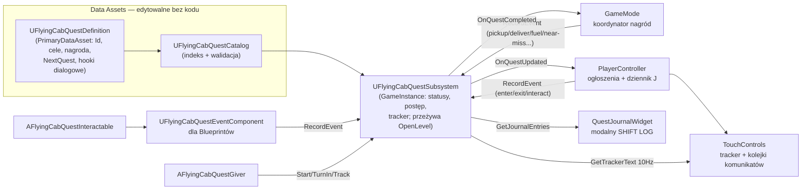

# Audyt uzupełniający — stan po wdrożeniu poprawek + ocena quest systemu

Data: 2026-08-18 · Kontynuacja raportu `AUDYT_UNREAL_FLYINGCABFLIGHTLAB_2026-08-10.md` · Tryb: read-only

Ścieżki względne wobec `unreal/FlyingCabFlightLab/`. Numery linii wg aktualnego working tree.

---

## 1. Stan working tree i zakres

- Gałąź `codex/unreal-audit-fixes` *(errata — pierwotnie raport błędnie podawał `main`)*, 10 nowych commitów od audytu (`fa63819..7173f37`): testy → ekstrakcja fleet/economy → data assets → Enhanced Input → hardening inputu/kamery → kontrakty migracji → fundament questów → dziennik i ogłoszenia → tuning kamery → poprawka docs. Historia czysta, jeden temat na commit — dokładnie to, o co prosił F-19.
- Niezcommitowane pozostają tylko **2 assety questowe**: zmodyfikowany `Content/Data/Quests/DA_FlyingCabQuestCatalog.uasset` i nowy `DA_Quest_Get_Money.uasset` — to Twoja bieżąca praca autorska w edytorze (omówiona w sekcji 5, N-01).
- Kod urósł z 7 929 do 15 451 linii (38 → 60 plików .h/.cpp): 8 nowych komponentów/aktorów domenowych, 8 plików quest systemu, 2 pliki testów (1 426 linii), 4 dokumenty w `docs/`.
- Metryka kluczowa: `FlyingCabGameMode.cpp` **1 355 → 592 linie**; `FlyingCabPawn.cpp` 1 139 → 872; PC przejął HUD i input (530 → 1 124 — świadomie, jako właściciel warstwy prezentacji).

Ograniczenia jak poprzednio: `.uasset` czytane wyłącznie na poziomie nazw/ścieżek/tabeli stringów (bez interpretacji struktury binarnej); zawartość IMC/IA i wartości w data assetach — do potwierdzenia w Editorze.

---

## 2. Weryfikacja wdrożenia ustaleń F-01…F-19

Zweryfikowałem deklaracje z `docs/AUDIT_IMPLEMENTATION_STATUS.md` w kodzie. Wynik: **17/19 potwierdzone w kodzie, 2 świadomie odłożone (zgodnie z rekomendacją), 1 drobny rozjazd doc-vs-kod** *(errata: dokument statusowy podaje przy F-11 „16 zielonych testów" — `docs/AUDIT_IMPLEMENTATION_STATUS.md:19` — kod zawiera 18: 12 Core + 6 Functional; do poprawienia w dokumencie)*.

| ID | Status z docs | Weryfikacja w kodzie | Dowód |
|---|---|---|---|
| F-01 | zakończone | ✅ `ShowEventMessage`/`ShowMajorAnnouncement` z kolejkami w HUD; PC przekierowuje wszystkie komunikaty; debug overlay tylko dla telemetrii F3 | `FlyingCabPlayerController.cpp:757-794`; `FlyingCabTouchControls.h:43-47,247-248`; `FlyingCabTouchControls.cpp:156-181` |
| F-02 | zakończone | ✅ `UFlyingCabFleetComponent`: rejestracja każdego pojazdu, bind `OnVehicleDestroyed` per pojazd, rozróżnienie active/parked, per-pojazd timery recovery, sprzątanie w `EndPlay` | `FlyingCabFleetComponent.cpp:53-71,83-110,27-51`; parked bez opłaty: `FlyingCabGameMode.cpp:452-463` |
| F-03 | zakończone | ✅ cache interactables/pojazdów odświeżany co ~1 s (`TWeakObjectPtr`), prompt kontekstowy throttlowany (~0,2 s) | `FlyingCabPlayerController.cpp:586-623,414-456` |
| F-04 | zakończone | ✅ GameMode = koordynator: komponenty Dispatch/Economy/Fleet/Run/HudPresenter/TrafficAwareness + aktor WorldBootstrap; delegaty bindowane w BeginPlay, zdejmowane w EndPlay | `FlyingCabGameMode.cpp:27-47,49-148,279-292` |
| F-05 | zakończone | ✅ pełny Enhanced Input: 7×IA + IMC w `Content/Input`, kontekst instalowany/zdejmowany przez PC, `FlushPressedKeys` nadpisane i czyszczące stan pawna synchronicznie; legacy mappings usunięte z `DefaultInput.ini` (potwierdzone brakiem `AxisMappings` w bindach kodu) | `FlyingCabInputData.cpp:24-55`; `FlyingCabPlayerController.cpp:288-312,352-387,121-133` |
| F-06 | zakończone | ✅ tag `EastBoundary` + heurystyka wyłącznie jako głośny fallback + `ensure` przy braku | `FlyingCabCityExpansion.cpp:16-19,57-66,101-107` |
| F-07 | zakończone | ✅ `UFlyingCabCityLayoutAsset` (`Content/Data/DA_FlyingCabCityLayout`) jako jedno źródło dzielnic/stacji/tras/bounds z fallbackiem C++ w `FlyingCabCityData`; test spójności `FlyingCab.Core.CityData.LayoutConsistency` | `FlyingCabCityData.h:11-23`; `FlyingCabCoreTests.cpp:556` |
| F-08 | zakończone | ✅ HUD na timerze (10 Hz, `InterfaceRefreshTimerHandle`), porównania wartości przed aktualizacją (`SetEconomyStatus` wychodzi wcześniej przy braku zmiany) | `FlyingCabPlayerController.cpp:44-50,1027-1038` |
| F-09 | oczekuje pomiaru | ✅ zgodne z rekomendacją (nie zmieniać stylistyki bez profilu na urządzeniu) | — |
| F-10 | zakończone | ✅ PC tworzy jeden trwały `InterfaceWidget` w BeginPlay; Pawn nie tworzy/nie adoptuje widgetu; tryb przełączany w `OnPossess` | `FlyingCabPlayerController.cpp:1058-1076,314-350` |
| F-11 | zakończone | ✅ 18 testów automation (12 Core + 6 Functional PIE), w tym dispatch/fare, economy, traffic, input-flush, progression, questy, run, vitals, world startup, kurs pasażerski, tow recovery, input dziennika. ⚠ Dokument statusowy podaje „16" — jedyny rozjazd doc-vs-kod, do aktualizacji | `FlyingCabCoreTests.cpp`, `FlyingCabFunctionalTests.cpp`; `docs/AUDIT_IMPLEMENTATION_STATUS.md:19` |
| F-12 | zakończone | ✅ `SaveVersion` w save (deklaracja w docs; plik nie ponownie czytany — niskie ryzyko) | `docs/AUDIT_IMPLEMENTATION_STATUS.md:20` |
| F-13 | zakończone | ✅ `FLIGHT_FEEL_TEST.md` przepisany (219 linii, aktualne miasto/tryby/HUD/EI) | plik |
| F-14 | zakończone | ✅ próg Time Attack przekazywany do menu z konfiguracji | `FlyingCabPlayerController.cpp:239-241` |
| F-15 | zakończone | ✅ `StartPassengerMarket(bDeterministic)` — stały seed tylko TA | `FlyingCabGameMode.cpp:161-164` |
| F-16 | zakończone | ✅ stacje na Begin/EndOverlap + `SetActorTickEnabled` warunkowo | `FlyingCabFuelStation.cpp:33-36,223,270` |
| F-17 | zakończone | ✅ Pawn bez SpringArm/Camera; `CameraTrackingOffset` jako zwykłe pole | `FlyingCabPawn.h:83,269` (brak komponentów kamery w pliku) |
| F-18 | odłożone | ✅ zgodnie z planem; nowy kod questowy używa `NSLOCTEXT` — konwencja przyjęta | np. `FlyingCabQuestSubsystem.cpp:252,268,274` |
| F-19 | zakończone | ✅ 10 commitów tematycznych | `git log` |

**Ocena jakości wdrożenia:** wysoka. Wzorce z rekomendacji zostały zastosowane wiernie, a miejscami lepiej niż proponowano (np. `FlushPressedKeys` nadpisane w PC tak, by silnikowy flush przy utracie fokusu *synchronicznie* czyścił też stan pawna i HUD — `FlyingCabPlayerController.cpp:121-133`; jawny `PlayerMode` usunął pochodną `IsPlayerOnFoot`; `docs/STATE_OWNERSHIP.md` utrzymywany jako żywy kontrakt). Poprzednie ustalenia P1 (F-01/02/03) uznaję za zamknięte.

Nowa architektura w jednym akapicie: GameMode pozostał cienkim koordynatorem zdarzeń między komponentami-właścicielami stanu (Dispatch=kurs, Economy=kredyty, Fleet=pojazdy+recovery, Run=tryb/wynik, TrafficAwareness=zagrożenia, HudPresenter=projekcja 10 Hz), WorldBootstrap buduje świat, PC posiada HUD i input, Pawn ma `VehicleVitalsComponent` (paliwo/kadłub). To jest dokładnie Etap 3 z planu, zrealizowany w całości.

---

## 3. Audyt quest systemu

### 3.1 Architektura (fakty)

Przepływ danych: rozgrywka emituje stabilne zdarzenia `FName` (10 wbudowanych — `FlyingCabQuestTypes.h:164-176`) → subsystem dopasowuje je do **bieżącego** celu każdego aktywnego questa (sekwencyjnie, z opcjonalnym filtrem `TargetId` i akumulacją `Amount` — `FlyingCabQuestSubsystem.cpp:98-181`) → zmiany wychodzą delegatami (`OnQuestUpdated/Completed/StateChanged/TrackedChanged`) → nagrody nalicza GameMode (`FlyingCabGameMode.cpp:574-592`), prezentację robi PC/HUD/dziennik. Stan runtime (`FFlyingCabQuestRuntimeState`) ma pola `SaveGame` i jest gotowy pod przyszły zapis (`FlyingCabQuestTypes.h:68-92`).

### 3.2 Ocena architektoniczna

**Mocne strony (potwierdzone):**

1. **Wzorcowe granice.** Subsystem nie zna UI, ekonomii ani aktorów; nagrody przyznaje właściciel domeny (GameMode→Economy/Progression); UI konsumuje wyłącznie projekcje (`FFlyingCabQuestJournalEntry`, `GetTrackerText`) i nie dotyka prywatnych map. To jest dokładnie odwrotność Godotowego autoloadu — zgodnie z kontraktami migracji.
2. **Zdarzenia zamiast switch-a.** Nowa mechanika = nowy `EventId` emitowany przez właściciela + wpis w Data Asset. Zero rozbudowy kodu questów przy dodawaniu treści — deklaracja z `docs/QUEST_AUTHORING.md:50` jest prawdziwa w kodzie (w `RecordEvent` nie ma żadnego switch-a po typach celów).
3. **Optymalizacja: system jest praktycznie darmowy w runtime.** Zero Ticków (subsystem, event component, giver, interactable — wszystkie bez ticku), koszt tylko przy zdarzeniu: O(liczba aktywnych questów) z porównaniem dwóch FName (`FlyingCabQuestSubsystem.cpp:105-130`). Tracker czytany w rytmie HUD 10 Hz (`FlyingCabHudPresenterComponent.cpp:229-238`), dziennik buduje projekcję tylko przy otwarciu/zmianie stanu. Ogłoszenia są kolejkowane z priorytetem i nie nadpisują się przed końcem ekspozycji (`FlyingCabTouchControls.cpp:156-181`). Jedyny koszt niestały: `NextQuest.LoadSynchronous()` przy ukończeniu (N-07).
4. **Higiena cyklu życia.** Wszystkie `AddDynamic` mają lustrzane `RemoveDynamic` (giver: `FlyingCabQuestGiver.cpp:76-93`; PC: `:81-99,868-884`; dziennik: `FlyingCabQuestJournalWidget.cpp:101-119` + `NativeDestruct`). Dziennik: pauza + `FInputModeUIOnly` + zdjęcie kontekstu EI + `FlushPressedKeys` przy otwarciu i zamknięciu (`FlyingCabPlayerController.cpp:808-866`) — scenariusz „otwórz przy trzymanym W" z `QUEST_AUTHORING.md:93` ma pokrycie i test PIE (`FlyingCab.Functional.PIE.QuestJournalInput`).
5. **Separacja trybów.** Freeroam włącza zdarzenia i auto-questy, Time Attack je wyłącza; tracker i dziennik znikają w TA (`FlyingCabGameMode.cpp:165-173`; `FlyingCabQuestSubsystem.cpp:239-241`; `FlyingCabPlayerController.cpp:817-824`). Jedna dziura w tej bramce — N-02.
6. **Lokalizowalność od startu**: teksty questowe w `FText`, formatowanie przez `NSLOCTEXT` — pierwszy podsystem zgodny z F-18.

**Ocena „prostoty budowania cykli fabularnych bez kodowania":** fundament jest właściwy — definicja questa to czysty Data Asset, questgiver i interactable są gotowymi aktorami, łańcuch przez `NextQuest`, auto-start flagą, katalog z twardą walidacją i fallbackiem demonstracyjnym. Workflow z `docs/QUEST_AUTHORING.md` jest realny. Ale w obecnej wersji projektant napotka cztery progi, które ograniczają obietnicę „bez kodowania" — to jest sedno ustaleń N-01, N-03, N-05, N-06 poniżej. Twoja pierwsza próba autorska (`DA_Quest_Get_Money`) trafiła od razu w dwa z nich.

### 3.3 Ustalenia — quest system i wdrożenie

**N-01** · **P1** · Pewność: wysoka · Obszar: autoring / walidacja
**Walidacja katalogu jest „wszystko albo nic" i cicho podmienia treść projektanta na fallback C++.** `UFlyingCabQuestCatalog::IsConfigurationValid` odrzuca cały katalog, jeśli **którykolwiek** quest jest niepoprawny (`FlyingCabQuestCatalog.cpp:99-117`); `LoadDefaultAsset` przy odrzuceniu podstawia wbudowane definicje demo (`:133-155`). Analiza tabeli stringów Twojego working tree: `DA_FlyingCabQuestCatalog` referencuje wszystkie 3 questy (rejestracja wykonana poprawnie), ale `DA_Quest_Get_Money` zawiera tytuł „Get 1000 credits" i `Reward.Credits`, natomiast **brak śladu serializacji `Objectives`, `EventId`, `ObjectiveId`** — quest niemal na pewno nie ma celów, więc nie przejdzie `IsConfigurationValid` (`FlyingCabQuestDefinition.cpp:29-33`), co unieważni **cały** katalog: w grze znikną także poprawne `FirstShift` i `NightshiftContract`, a pojawią się definicje demo z C++. Jedyny sygnał to Error/Warning w Output Log.
Scenariusz/koszt: projektant dodaje jeden niedokończony quest → cała treść fabularna gry po cichu wraca do wersji wbudowanej; bez zaglądania w log wygląda to jak „edytor nie zapisał moich zmian".
Rekomendacja (dwustopniowa): (a) **degradacja per-quest** — katalog loguje i pomija niepoprawne wpisy, zamiast odrzucać całość (zmiana w `ConfigureCatalog`/`LoadDefaultAsset`); (b) walidacja w edytorze przez `EditorValidatorBase`/`IsDataValid` na `UFlyingCabQuestDefinition` i katalogu — błędy widoczne przy zapisie assetu, nie w runtime. Zakres: lokalny · Wysiłek: mały · Editor: tak (potwierdzić w Output Log, że obecny stan faktycznie używa fallbacku).

**N-02** · **P1** · Pewność: wysoka · Obszar: granica trybów / integralność wyniku
**`TurnInQuest` i nagroda nie są bramkowane trybem.** Wszystkie wejścia questowe mają bramkę `bGameplayEventsEnabled` (`FlyingCabQuestSubsystem.cpp:76,100,193,239`) — **oprócz `TurnInQuest` (`:183-188`)**, a `HandleQuestCompleted` w GameMode dodaje kredyty bez sprawdzenia trybu (`FlyingCabGameMode.cpp:574-592`). Subsystem żyje w GameInstance, więc quest w stanie `ReadyToTurnIn` z sesji Freeroam przeżywa przejście do Time Attack; gracz może wtedy podejść do questgivera (interakcja pieszo działa w TA), oddać zadanie i **dostać kredyty questowe w trakcie konkurencyjnego runu** — wbrew kontraktowi z `docs/STATE_OWNERSHIP.md:34` i krokowi 9 testu ręcznego; wynik trafia do trwałego leaderboardu.
Rekomendacja: bramka `bGameplayEventsEnabled` w `TurnInQuest` (1 linia) — wtedy giver pokaże „turn-in failed"; opcjonalnie druga bramka w `HandleQuestCompleted` po stronie GameMode (defense in depth). Dodać przypadek do testu `FlyingCab.Core.Quests.EventDrivenLifecycle`. Zakres: lokalny · Wysiłek: mały · Editor: nie.

**N-03** · **P2** · Pewność: wysoka · Obszar: autoring / ekspresja celów
**Cel „zdobądź 1000 kredytów" nie jest dziś wyrażalny — i to nie przypadek, że pierwszy autorski quest utknął.** Wbudowane zdarzenia to wyłącznie liczniki akcji (`FlyingCabQuestTypes.h:164-176`); nie istnieje żadne zdarzenie ekonomiczne. Do tego `Passenger.Delivered` jest emitowane **bez `TargetId`** (`FlyingCabGameMode.cpp:369-372`), a `Passenger.PickedUp` z `TargetId` będącym **nazwą wyświetlaną** dzielnicy (`FName(*DestinationName)` — `:336-343`), podczas gdy własna dokumentacja mówi „tekst nie jest identyfikatorem logiki" (`docs/QUEST_AUTHORING.md:3`), a `FFlyingCabDistrictDefinition` nie ma stabilnego pola Id (`FlyingCabCityData.h:11-23`). Skutki: nie można zbudować bez kodu celów typu „dowieź pasażera do Ashline Market", „zarób X", „wydaj X na paliwo".
Rekomendacja: (a) dodać `FName DistrictId` do definicji dzielnicy w CityLayout i emitować je jako `TargetId` przy pickup **i** deliver; (b) dodać zdarzenie `Economy.CreditsEarned` emitowane z `AddCredits` z `Amount` = przyznane kredyty — wtedy „zarób 1000" to zwykły cel z `RequiredCount=1000` (mechanika akumulacji `Amount` już istnieje w `RecordEvent:137-140`); analogicznie ewentualne `Economy.CreditsSpent`. Zakres: wieloklasowy · Wysiłek: mały · Editor: aktualizacja assetu CityLayout.

**N-04** · **P2** · Pewność: wysoka · Obszar: autoring / odporność na literówki
**`EventId`/`TargetId`/`QuestId` to wolne pola FName wpisywane ręcznie.** Literówka („Passanger.Delivered") kompiluje się, waliduje (pole niepuste) i po prostu nigdy nie postępuje — najgorszy rodzaj błędu dla nie-programisty, bo bezobjawowy. Lista poprawnych `EventId` istnieje tylko w C++ i w markdownie.
Rekomendacja (wybór jednej z dwóch): (a) **GameplayTags** — przenieść zdarzenia na `FGameplayTag` (drzewo `Quest.Event.*`, `Quest.Target.District.*`) → edytor daje dropdown, walidację i hierarchię; koszt: zależność od GameplayTags i migracja 10 stałych; (b) tańszy wariant bez nowego modułu: walidator katalogu porównujący `EventId` z centralną listą `FlyingCabQuestEvents` (+ znane `TargetId` z CityLayout) i zgłaszający nieznane wartości jako błąd walidacji. Wariant (a) jest docelowo lepszy pod dialogi/warunki; (b) można mieć dziś. Zakres: lokalny/wieloklasowy · Wysiłek: (b) mały, (a) średni.

**N-05** · **P2** · Pewność: wysoka · Obszar: „cykle" fabularne
**Brak questów powtarzalnych i resetu pojedynczego questa.** `Completed` jest stanem terminalnym (`StartQuest` odmawia przy istniejącym stanie — `FlyingCabQuestSubsystem.cpp:81-85`), istnieje tylko globalny `ResetAllQuests`. Skoro celem systemu są *cykle* fabularne (kontrakty dnia, powtarzalne zlecenia dzielnic), to pętli nie da się dziś zamknąć bez kodu — łańcuch `NextQuest` jest słusznie zabezpieczony przed restartem ukończonego questa, więc cykl A→B→A urywa się na drugim okrążeniu.
Rekomendacja: flaga `bRepeatable` w definicji (po ukończeniu stan wraca do `Inactive` z wyczyszczonym postępem, `CompletionOrder` zachowany dla historii) + opcjonalny cooldown; wpis w dzienniku po stronie COMPLETED z licznikiem ukończeń. Zakres: lokalny (subsystem+definicja) · Wysiłek: mały/średni.

**N-06** · **P3** · Pewność: wysoka · Obszar: workflow edytora
**Wzorzec `static + AddToRoot` w loaderach assetów** (katalog: `FlyingCabQuestCatalog.cpp:133-155`; ekonomia: `FlyingCabEconomyAsset.cpp:58-73`; input: `FlyingCabInputData.cpp:24-55`). Konsekwencje w edytorze: pierwszy PIE po starcie edytora zamraża wybór assetu na cały proces — jeśli katalog był wtedy niepoprawny/nieobecny, kolejne sesje PIE używają fallbacku nawet po naprawieniu assetu (naprawa wymaga restartu edytora); obiekty są zrootowane na zawsze. W buildzie gry bez znaczenia, w iteracji designerskiej — zaskakujące.
Rekomendacja: rozwiązywać asset per `GameInstance::Init` (miejsce już istnieje: `InitializeQuests`) zamiast statyka procesowego, lub przynajmniej czyścić cache przy `FEditorDelegates::EndPIE`. Zakres: lokalny · Wysiłek: mały.

**N-07** · **P3** · Pewność: wysoka · Obszar: wydajność (drobne)
`CompleteQuest` woła `NextQuest.LoadSynchronous()` na wątku gry (`FlyingCabQuestSubsystem.cpp:360`). Przy obecnych mini-assetach koszt pomijalny; przy większych łańcuchach (ikony, dialogi w przyszłości) — hitch w momencie fanfar ukończenia. Rekomendacja: preload łańcucha przy `ConfigureCatalog` albo `StreamableManager::RequestAsyncLoad` przy starcie questa poprzedzającego. Odnotować, nie przebudowywać.

**N-08** · **P3** · Pewność: wysoka · Obszar: UX trackera
`StartQuest` zawsze przejmuje tracker (`SetTrackedQuestInternal(QuestId)` — `FlyingCabQuestSubsystem.cpp:92`), więc auto-start lub łańcuch nadpisze ręczny wybór gracza z dziennika (`TRACK`). Rekomendacja: przejmować tracker tylko gdy `TrackedQuestId.IsNone()` albo gdy start pochodzi z jawnej interakcji gracza. Zakres: lokalny · Wysiłek: mały.

**N-09** · **P3** · Pewność: średnia · Obszar: lifecycle (odziedziczone z Fleet)
Timer recovery w Fleet binduje **surowy wskaźnik** pawna jako payload delegatu (`RecoveryDelegate.BindUObject(this, &...::RecoverVehicle, Pawn)` — `FlyingCabFleetComponent.cpp:125-126`). Bezpieczne, dopóki żaden `AFlyingCabPawn` nie jest niszczony w trakcie gry (dziś nie jest), ale to jedyne miejsce w nowym kodzie z niechronionym wskaźnikiem w odroczonym wywołaniu. Rekomendacja: `TWeakObjectPtr` w payloadzie i `Get()` w handlerze. Wysiłek: mały.

Dodatkowe obserwacje bez rangi ustalenia: (a) `QuestGiver.Interact` emituje `QuestGiverInteracted` przed obsługą stanu — poprawne (bramka trybu w `RecordEvent` chroni TA); (b) `bEmitOnce` w event komponencie zużywa się dopiero, gdy zdarzenie faktycznie popchnęło questa (`FlyingCabQuestEventComponent.cpp:34-37`) — przemyślany szczegół, wart komentarza w kodzie, bo wygląda na przeoczenie; (c) dziennik zamykany też klawiszami w `NativeOnKeyDown` (Esc/J) mimo zdjętego kontekstu EI (`FlyingCabQuestJournalWidget.cpp:137-152`) — poprawnie rozwiązany problem „jak zamknąć modal bez kontekstu wejścia".

---

## 4. Co dalej (proponowana kolejność)

1. **N-02**: bramka trybu w `TurnInQuest` + przypadek testowy (5 minut, chroni leaderboard).
2. **N-01a**: degradacja per-quest w walidacji katalogu (żeby jeden zepsuty asset nie kasował treści).
3. **Naprawa `DA_Quest_Get_Money` w edytorze** — po (1)+(2) i **N-03b** (`Economy.CreditsEarned`): cel = 1 objective, EventId `Economy.CreditsEarned`, RequiredCount 1000. Sprawdzić w Output Log, że katalog przechodzi walidację i że quest pojawia się w SHIFT LOG.
4. **N-03a**: stabilne `DistrictId` w CityLayout + `TargetId` dla pickup/deliver — otwiera cele „dowieź do dzielnicy X" bez kodu.
5. **N-04b**: walidacja `EventId` przeciw znanej liście (natychmiastowy zysk); decyzję o GameplayTags podjąć przy projektowaniu dialogów (tam tagi opłacą się podwójnie — warunki dialogowe).
6. **N-05**: `bRepeatable` — dopiero to domyka obietnicę „cykli" fabularnych.
7. Porządki niższej rangi przy okazji: N-06, N-07, N-08, N-09.

Do sprawdzenia ręcznie w Unreal Editor: (a) Output Log po otwarciu projektu — czy `DA_Quest_Get_Money` generuje `Invalid quest asset...` i czy katalog jest odrzucany (potwierdzenie N-01); (b) zawartość `IMC_FlyingCabGameplay` (mapowania J/Esc, brak konfliktów z Q); (c) przejście testu ręcznego z `docs/QUEST_AUTHORING.md:81-93` po naprawie assetu; (d) F-09 bez zmian — czeka na profil GPU na urządzeniu.

## 4a. Errata i uzgodnienia po recenzji Codexa (2026-08-18)

Codex zweryfikował raport w środowisku uruchomieniowym. Ustalenia wspólne:

- **Dwa błędy raportu poprawione powyżej**: gałąź to `codex/unreal-audit-fixes` (nie `main`); dokument statusowy podaje 16 testów przy 18 w kodzie, więc „0 rozjazdów doc-vs-kod" było nieprawdziwe.
- **N-01 potwierdzone twardo**: log Unreal wprost zgłasza brak celów w `DA_Quest_Get_Money` i odrzucenie całego katalogu — to już nie hipoteza z tabeli stringów, tylko zaobserwowany stan runtime.
- **N-02 potwierdzone jako najpilniejsze** — bez zmian.
- **N-03 doprecyzowane**: `Economy.CreditsEarned` pokrywa tylko semantykę „zarób łącznie X". Cel „osiągnij saldo X" wymaga innego mechanizmu, bo `RecordEvent` akumuluje delty i nie obserwuje stanu (saldo spada przy paliwie/naprawach/holowaniu, więc obie semantyki dają różne wyniki). **Decyzja produktowa wymagana przed implementacją** — warianty: (a) zarobek łączny (event z `Amount`, zero nowych mechanizmów), (b) saldo (najczyściej: jednorazowe zdarzenie progowe emitowane przez `UFlyingCabEconomyComponent` po przekroczeniu progu skonfigurowanego w definicji questa — wymaga małego rozszerzenia: subsystem zgłasza ekonomii progi aktywnych celów albo Economy emituje `Economy.BalanceChanged`, a subsystem dostaje drugi, jawny typ celu progowego; nie ukrywać semantyki progu w akumulatorze `RequiredCount`).
- **N-05 przeklasyfikowane**: propozycja funkcji, nie błąd. `bRepeatable` dopiero po zaprojektowaniu kontraktów powtarzalnych.
- **N-06 zawężone**: realny problem to utrwalenie fallbacku po pierwszym nieudanym odczycie (dokładnie obecny stan katalogu). Naprawa loadera questów pilna, input/ekonomia mogą poczekać.
- **N-07 zdegradowane do teorii**: katalog trzyma twarde referencje (`TObjectPtr` w `UFlyingCabQuestCatalog::Quests`), więc questy z katalogu są załadowane razem z nim; `LoadSynchronous` dotknie dysku tylko dla łańcucha wskazującego poza katalog.
- **N-08 rozszerzone**: dodatkowo `StartAutoQuests` iteruje `TMap` (`FlyingCabQuestSubsystem.cpp:64`), więc przy kilku auto-questach to, który przejmie tracker, zależy od kolejności iteracji mapy — niedeterministyczne. Poprawka trackera powinna objąć oba przypadki (deterministyczna kolejność startu + brak przejmowania trackera od auto-startów).
- **N-09 potwierdzone** jako małe ryzyko przyszłościowe.

Uzgodniona kolejność wdrożenia (zastępuje sekcję 4): (1) bramka trybu dla turn-in + nagród i test regresji; (2) katalog pomija pojedynczy wadliwy quest, fallback dopiero przy zerze poprawnych; (3) walidacja widoczna w edytorze; (4) zdarzenie ekonomiczne wg podjętej decyzji (niżej); (5) stabilne `DistrictId` + `TargetId` także przy dostarczeniu; (6) przy okazji N-08 i N-09; (7) powtarzalność i async loading później.

**Decyzja produktowa (2026-08-18, właściciel projektu): „Get 1000 credits" = zarobek łączny.** Zakres dla punktu 4: nowe zdarzenie `Economy.CreditsEarned` emitowane z `UFlyingCabEconomyComponent::AddCredits` z `Amount` = faktycznie przyznane kredyty (po ewentualnym obcięciu), przekazywane do `UFlyingCabQuestSubsystem::RecordEvent` przez GameMode jak pozostałe zdarzenia. Cel questa: 1 objective, `EventId=Economy.CreditsEarned`, `RequiredCount=1000`. Wydatki (paliwo/naprawy/holowanie) nie emitują tego zdarzenia i nie cofają postępu. Uwaga na podwójne liczenie: nagroda za ukończenie questa również przechodzi przez `AddCredits` — do rozstrzygnięcia przy implementacji, czy nagrody questowe emitują `CreditsEarned` (rekomendacja: tak, spójnie — ale quest kończy się przed własną nagrodą, więc pętli nie ma). Cel progowy salda: świadomie odłożony, nie projektować na zapas.

## 5. Podsumowanie

Wdrożenie poprawek jest rzetelne i kompletne względem raportu z 2026-08-10 — łącznie z rzeczami trudnymi (Enhanced Input z synchronicznym flushem, flota z klasyfikacją active/parked, HUD 10 Hz, 18 testów, żywa dokumentacja stanu). Quest system ma **dobrą architekturę** (event-driven, zero ticków, czyste granice, data-driven z fallbackiem, lokalizowalny) i **właściwy kierunek** na budowanie fabuły w UI edytora. Cztery rzeczy dzielą go od tej obietnicy w praktyce: bramka turn-in w Time Attack (N-02), łagodna walidacja katalogu (N-01), zdarzenia ekonomiczne + stabilne Id celów (N-03/04) i powtarzalność questów (N-05). Wszystkie są małe; żadna nie wymaga przebudowy fundamentu — co samo w sobie jest dobrą oceną tego fundamentu.
