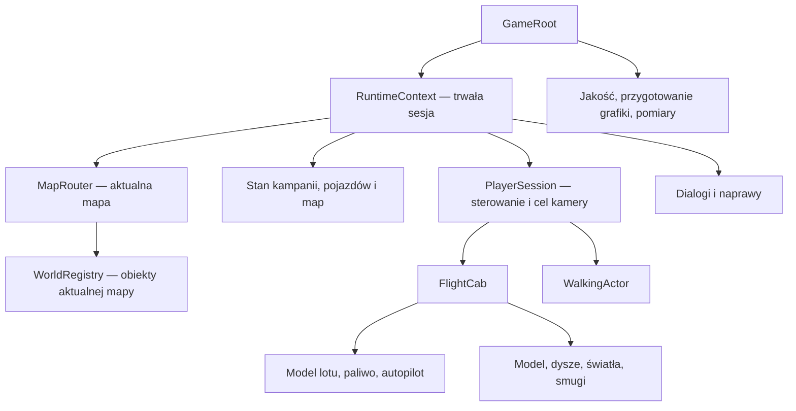

# Architektura i wydajność po audycie — 2026-09-12

**Wejście i upadki 2026-09-16:** [tryb pieszy](ON_FOOT.md) używa punktu kabiny `VehicleDefinition.driver_door_x`, pozwala opuścić auto w locie z jego prędkością i nalicza obrażenia przy lądowaniu. `PlayerState.health` jest opcjonalnym polem schematu 5 (starsze zapisy: 100 HP); zero HP blokuje sterowanie, zapisuje śmierć i otwiera ekran nowej gry. Nie jest to system walki. Pionowa trasa `spine` ma ruch prawostronny. Testy: `vehicle-access`, `vehicle-access-render`, `on-foot`, pełny `living-world`, `start-menu`.

**Kamera 2026-09-14:** [podejście i kadr pieszy](PLATFORM_CAMERA.md). `PlatformCameraFraming` wylicza bliskość górnej powierzchni platformy z jej kolizji i prędkości auta. Poziom płynnie łączy szeroki lot, lądowanie i bliski, poziomy kadr pieszy z obszarem swobodnego skoku. Parametry są w `FlightCameraTuning`; odtworzenie zapisu i przygotowanie grafiki ustawiają kadr właściwy dla aktualnego aktora. Testy: `platform-camera`, `platform-camera-render`, `on-foot-render`, `presentation`, `boot`.

**Ekran startowy 2026-09-14:** [menu i pełny reset](START_SCREEN.md). `game.tscn` pokazuje edytowalną scenę menu z grafiką starego Godota. `RuntimeContext` i miasto są tworzone dopiero po Kontynuuj / Nowa gra. Reset od razu zapisuje nową sesję, zachowuje konfigurację punktu wejścia i odrzuca opóźniony zapis starej gry. `TaxiHud` udostępnia tę samą akcję z potwierdzeniem w opcjach. Testy: `start-menu`, `start-menu-render`, `boot`.

**Dialogi i questy 2026-09-14:** [autorowanie i zakres](NARRATIVE_AUTHORING.md). `RuntimeContext` posiada `NarrativeService` i `DialogueSession`; definicje są zasobami `.tres`, a stan postępu oddzielnym snapshotem. Cele reagują na zdarzenia, stan i fakty. Efekty odpowiedzi zatwierdzają wspólnie portfel, kampanię, przedmioty i questy. `NarrativeNpc`, `NarrativeArea` i adaptery taxi/paliwa/napraw/pojazdów łączą system ze światem. `NarrativePanel` prezentuje pionowy dialog i dziennik, pauzuje świat i nie przejmuje logiki questów. Schemat 5 dodaje stan narracji; odczyt 1–4 zachowuje dotychczasowe dane. Zaimplementowano przykładową dostawę leku i zadanie poboczne, nie pełną kampanię. Testy: `narrative-validate`, `narrative`, `narrative-render`.

**Living world 2026-09-13:** [wdrożenie, autorowanie i testy](LIVING_WORLD.md). Sesja posiada `LivingWorldState`, mapa `LivingWorldDirector`, a `TrafficDriver` prowadzi zwykły `FlightCab` przez kontrakt kierowcy. Działają pętle aut, piesi, pełne podróże mieszkańców i przejęcie zaparkowanego auta z anulowaniem planu właściciela. Schemat 4 odtwarza populację i skradziony pojazd. `WorldLayers` oddziela geometrię, ludzi i pojazdy; Ari i NPC chodzą na Z = 1,2 bez wzajemnych kolizji. Nowe testy: `living-world`, `living-world-render`. Poniższe wpisy zachowują historię wcześniejszych etapów.

**Tryb pieszy 2026-09-13:** [Ari — zakres i weryfikacja](ON_FOOT.md). Widoczny Ari chodzi, skacze, bezpiecznie wysiada i wraca do zaparkowanego pojazdu. Wspólne sterowanie, kamera i HUD przełączają tryb; `PlayerState` zapisuje pozycję i tryb od schematu 3; schemat 4 dodał populację; aktualny schemat 5 opisano powyżej. `OnFootInteraction` wykonuje zapytania fizyczne i używa `PlayerSession`. Wnętrza, drzwi i zdrowie Ariego wymagają dalszej zawartości. Pierwsze dialogi w świecie dodano w etapie narracji. Nowe testy: `on-foot`, `on-foot-render`.

**Biblioteka pojazdów 2026-09-13:** [nowy stan wdrożenia](VEHICLE_LIBRARY.md) — dziesięć własnych modeli 3D plus cab i legacy shuttle, wspólny aktor/fizyka, odtwarzanie wyglądu i komponentów z zapisanej definicji, osobna odporność oraz scena przeglądowa. Geometria jest zapisana w scenach; generator działa wyłącznie na jawne polecenie. Laweta ma model i punkt ładunku. Traffic i kradzież dodano w etapie living world. Policyjna AI i przewóz ładunku pozostają poza obecnym zakresem. Nowa biblioteka przeszła weryfikację Windows; macOS i telefon czekają na sprawdzenie.

**Rozszerzenie z 2026-09-13:** działają już pasażerowie, kursy, nawigacja, wspólny portfel usług i automatyczny zapis sesji (schemat 2, zgodność ze schematem 1). [Aktualny opis wdrożenia](FIRST_GAMELOOP_IMPLEMENTATION.md). Poniżej historia fundamentów i pomiarów wcześniejszego etapu.

**Pojazdy i warsztaty 2026-09-13:** [nowe wdrożenie](VEHICLES_AND_REPAIR.md) opisuje modele w Inspectorze, fizykę masy, obrażenia i naprawy. Aktualna paczka: `build/city03-59cf0ff42a4a-itch.zip`.

**Aktualizacja geometrii 2026-09-13:** [naprawa eksportu](WEB_GEOMETRY_FIX_2026-09-13.md) usuwa utratę transformacji grup detali podczas kompilacji headless. Wcześniejsze pomiary po optymalizacji nie obejmowały kompletnej geometrii; aktualne wartości i status paczki podano poniżej oraz w raporcie naprawy.

Wdrożono stabilizację renderowania i fundamenty potrzebne do rozszerzania prototypu. Pokaz nadal pozwala latać po City 02. Ma nowy ekran przygotowania grafiki, ograniczenie kosztu renderowania na Web oraz sesję niezależną od aktualnego auta i mapy. Działają już także obrażenia od kolizji i warsztaty z naprawą pod E/dotykiem. Chodzenie po wnętrzach nadal wymaga grywalnej zawartości; pierwsze rozmowy opisano w aktualizacji narracji. Szczegóły nowych modeli: [pojazdy i naprawa](VEHICLES_AND_REPAIR.md).

Zakres zatwierdzony przez autora: lot, tryb pieszy, różne pomieszczenia i mapy, dialogi, naprawa auta, living world, kradzież pojazdów i kampania z lekiem. System walki ma zostać dodany w przyszłości; jego reguły nadal są nieustalone. [Wizja gry](../../../docs/GAME_VISION.md) opisuje cel, a ten dokument stan implementacji. [Audyt](ARCHITECTURE_PERFORMANCE_AUDIT_2026-09-12.md) zachowuje pomiary sprzed zmian.

## Co jest wdrożone

| Obszar | Działający fundament | Pozostała zawartość i integracja |
| --- | --- | --- |
| Start i rendering | Przygotowanie materiałów i efektów przed lotem; selektywne cienie; detale w małych MultiMesh; profile jakości; lokalne pomiary klatek | Eksport i weryfikacja nowej wersji w Chrome na S25+ |
| Postać i auto | Wspólny kontrakt poleceń, kamera/HUD/atmosfera, osobne ID właściciela, kierowcy i pasażerów; widoczny Ari, Q/dotyk, sprawdzanie wolnej przestrzeni i zasięgu wejścia | Kradzież i reakcja NPC |
| Tryb pieszy | `WalkingActor`: ruch XY, grawitacja, kolizje, skok, animacje, klawiatura/dotyk, przekazanie sterowania i zapis pozycji | Grywalne wnętrza, drzwi, zdrowie i ocena sterowania na fizycznym telefonie |
| Mapy i wnętrza | Katalog scen, nazwane wejścia, wspólna sesja, zachowanie lokalnego stanu pomieszczeń oraz zaparkowanego auta | Autorskie wnętrza, drzwi, przejścia, rozmieszczenie postaci i zasady transportu auta między różnymi mapami |
| Dialogi i questy | Zasoby autora, transakcje skutków, warunki/fakty, sekwencyjne cele, pionowy UI, dziennik, walidator i podgląd | Finalny scenariusz, portrety i rozbudowa kampanii |
| Pojazdy, obrażenia i naprawa | Modele w Inspectorze, ciąg/masa, HP, limit miejsc, zapis modelu, kolizje, wyłączenie napędu przy 0 HP, dwa płatne warsztaty z klawiaturą/dotykiem | Osobna grafika modeli, animowane uszkodzenia, balans gospodarki i odzyskiwania wraku |
| Kampania i zapis | JSON 5 z odczytem 1–4, stan aut/map/NPC/narracji, zakup i powtarzalna dostawa leku, trwałe potwierdzenia nagród i koniec czasu | Finalny balans, migracje przyszłych zmian treści i pozostała kampania |
| NPC i walka | Ruch na autostradach i w dzielnicach, piesi, pełne podróże, kolejki skrzyżowań, przejmowanie aut i zapis planów | Omijanie dowolnych blokad, sprzątanie wraków, ekonomia NPC i poziomy szczegółowości symulacji; projekt oraz implementacja walki |

## Granice systemów

Reakcja silników (2026-09-13): `FlightCab` ma prywatny `ThrustResponse`. Kolejność obliczeń to polecenie kierowcy/autopilota → odpowiedź silnika → ograniczenie paliwem → integracja prędkości → prezentacja. Czasy narastania i wygaszania pochodzą z `VehicleDefinition`; wejście klawiatury/dotyku pozostaje bez zwłoki. `FlightModel` płynnie dołącza tłumienie dryfu przy malejącej mocy. Aktor z pamięcią sterowania może implementować `clear_control_input()`; `PlayerSession.suspend()` wywołuje je przy blokadzie. Zwykłe zerowe polecenie jest puszczeniem gazu, a reset/blokada/zmiana kierowcy usuwa zakumulowaną moc natychmiast. Test integracji: `bash tools/verify.sh thrust`.

Sceną startową projektu jest `scenes/game.tscn`. Po wyborze w menu jej `scripts/game_root.gd` składa zależności: tworzy `RuntimeContext`, rejestruje mapy i dialogi; sesja udostępnia naprawy także przy F6, a scena startowa ustala jakość, przygotowuje grafikę, następnie oddaje sterowanie. F5 i zwykłe uruchomienie korzystają z tej ścieżki. F6 w `flight_lab.tscn` pozostaje skrótem do samego poziomu, z lokalną sesją, bez pełnego przygotowania grafiki.



`RuntimeContext` ma czas życia sesji, a `WorldRegistry` czas życia aktualnej mapy. Zapis zawiera wartości i stabilne identyfikatory; referencje do węzłów nie trafiają do JSON. `register_system(id, system)` rejestruje jawne usługi i odrzuca duplikaty. Sygnały domenowe łączą konkretne zależności, bez rozsyłania całego stanu świata co klatkę.

### Sterowanie i pojazd

`PlayerSession.take_control(actor, mode)` obsługuje pojazd i postać. Aktor udostępnia `assign_driver(id) -> revision`, `receive_command(vector, id, revision)` i opcjonalnie `driver_changed`, `get_driver_id`, `get_control_velocity`. Polecenie ze starym ID lub numerem przejęcia jest odrzucane; zmiana kierowcy zeruje poprzednie polecenie. NPC ma korzystać z tego samego kontraktu co gracz. `cab.command` pozostaje dostępne dla dotychczasowych izolowanych testów fizyki, ale nowe kontrolery nie powinny wpisywać go bezpośrednio.

Właściciel, kierowca i pasażerowie są odrębnymi polami `VehicleState`. Przejęcie sterowania nie podmienia auta i nie resetuje jego stanu. `OnFootInteraction` sprawdza postój i dostępność auta NPC, a `LivingWorldDirector.take_vehicle()` anuluje jego podróż i odsyła właściciela do budynku. Konsekwencje fabularne, dialog i policyjna reakcja pozostają dalszym etapem.

Kamera, HUD i atmosfera śledzą `PlayerSession.focus`. Przy zmianie celu odpinane są sygnały poprzedniego pojazdu i czyszczone sterowanie. Blokady `dialogue`, `map_transition` i `application_focus` są niezależne: zwolnienie jednej nie zwalnia pozostałych. Blokada wejścia nie zatrzymuje ogólnie całej fizyki świata. Populacja subskrybuje ją jawnie: zatrzymuje plany i zamraża auta NPC do czasu zwolnienia wszystkich blokad. Menu dodatkowo pauzuje drzewo sceny.

`FlightCab` nadal odpowiada za integrację fizyki, kontakt i wykonanie polecenia z autopilotem. `VehicleFuel` rozlicza paliwo, `VehiclePresentation` przechył modelu, a istniejące komponenty świateł i dysz czytają wynik lotu. Parametry mają osobne zasoby: `VehicleDefinition` — ID modelu, masa, siły ciągu, wytrzymałość, miejsca, lot i paliwo; `CityDefinition` — miasto i reguły przestrzeni; `FlightCameraTuning` — kamera; `VehiclePresentation` — wygląd ruchu. Prywatny stan animacji nie jest współdzielony między autami.

### Dodawanie mapy lub pomieszczenia

1. Utwórz scenę z korzeniem `Node3D`, polem `context: RuntimeContext`, zasobem `definition: MapDefinition` i metodą `capture_map_state() -> Dictionary`. `CityDefinition` rozszerza ogólną definicję o reguły lotu i dzielnice. Wnętrze może korzystać z samego `MapDefinition` i nie wymaga węzła `Cab`.
2. Nadaj unikalne `map_id` i jawne `entry_points`. W `_ready()` wywołaj `context.world.bind(self, definition)`, podepnij kontroler/prezentację i zarejestruj aktorów. Opcjonalne `restore_map_state(data)` odtwarza stan lokalny, a `arrive_at(entry)` ustawia wejście oraz postać. Punkty wejścia nie teleportują aktora samodzielnie — realizuje to mapa.
3. Zarejestruj `PackedScene` przez `MapRouter.register_map(id, scene)`. Przejście wykonuj przez `await maps.enter(id, prepare_map, entry)`. Katalog jest jawny; zapis nie podaje dowolnych ścieżek plików do wczytania.
4. Przed opuszczeniem poziomu router zapisuje jego stan, zwalnia sterowanie i rejestr, a nowemu poziomowi przekazuje tę samą sesję przed `_ready()`. Waliduje scenę i wejście przed usunięciem aktualnej mapy. Zapis w aktywnym pomieszczeniu również pobiera jego najnowszy stan.
5. Duża nowa mapa powinna dostarczyć własne `prepare_graphics()` lub rozszerzyć przygotowanie miasta o nowe efekty. Domyślny wariant ogólnej mapy czeka na dwa renderowania jej początkowego widoku; nie udaje przygotowania wszystkich niewidocznych pomieszczeń.

Test przechodzi pomiędzy City 02 i osobną sceną pokoju bez auta, zachowuje paliwo i pozycję zaparkowanego pojazdu, nazwane wejście, wizyty i zasoby kampanii. Scena pokoju jest fixture'em testowym, nie ukończoną lokacją gry.

Pojazdy otrzymują stabilne `entity_id` oraz `initial_owner_id`. ID musi być unikalne w całej sesji i niezależne od nazwy węzła. Mapa podpina pojazd do `RuntimeContext.bind_vehicle`, aby odtworzyć jego istniejący stan. Usunięcie reprezentacji auta przez przyszły system populacji wymaga wcześniejszego `capture_state()`. Przenoszenie auta na inną mapę będzie wymagało jawnej aktualizacji mapy i pozycji oraz zapobiegania utworzeniu drugiej reprezentacji tego samego ID.

Rejestr śledzi również węzły dodane i usunięte po starcie. Listy autostrad, lądowisk, warsztatów i pojazdów nie są już niezmiennym odczytem z pierwszej klatki. Nowe grupy/metadata nadawaj przed wejściem węzła do drzewa albo jawnie wywołaj `register(node)`. Metadane `services` lądowisk są deklaracją danych; obecne darmowe tankowanie pozostaje regułą pokazu, nie gotową ekonomią usług.

### Dialogi, naprawa, kampania i zapis

`DialogueSession.begin()` sprawdza graf kwestii i krawędzi przed rozpoczęciem rozmowy. UI subskrybuje `line_changed`, wysyła `choose(id)` i reaguje na `finished`. Moduł emituje `choice_selected(conversation_id, choice_id)`; adapter konkretnego zadania lub warsztatu interpretuje wybór i wywołuje właściwą usługę. Dane dialogu nie zawierają wykonywalnych nazw metod.

`VehicleService.repair(state, model, campaign, amount_hp, cost_per_hp)` przywraca faktyczne HP i pobiera wyłącznie odpowiadającą im opłatę; przy niewystarczających środkach wykonuje dostępną część naprawy. `WorkshopInteraction` sprawdza aktywnego kierowcę, blokady sesji i postój na podłożu warsztatu. `FlightCab.apply_damage(amount_hp, source)` przekazuje obrażenia do `VehicleVitals`. Zderzenia używają tego samego modułu; 0 HP wyłącza napęd. Ceny i parametry obrażeń pozostają próbnym balansem. `VehicleState.condition` zachowuje format 0–1, a HP wynikają z definicji modelu. Zapis zawiera `model`; brak tego pola w starszym zapisie oznacza `basic_cab`.

`CampaignState` jest domyślnie nieaktywny w pokazie lotu. Dostarczenie leku zużywa dawkę i wydłuża pozostały czas; ID dostawy uniemożliwia ponowne zaliczenie, również po wczytaniu. Wygaśnięcie zgłaszane jest raz. Robocza polityka liczy wyłącznie czas aktywnej gry, z pauzą przy utracie fokusu i blokadzie sterowania, bez naliczania czasu offline. Ostateczna polityka czasu podczas dialogów nadal wymaga decyzji projektowej.

`RuntimeContext.save_to()` zapisuje JSON przez plik tymczasowy i zmianę nazwy. `restore()` sprawdza cały obsługiwany schemat przed zmianą stanu i wymaga sesji bez aktywnie sterowanego aktora. Docelowa ścieżka wczytania to nowa, odłączona sesja, potem wejście przez katalog map. Menu startowe, autosave i odczyt schematów 1–5 opisano w aktualizacjach powyżej. Nowe zmiany struktury treści wymagają osobnych migracji.

## Optymalizacje grafiki

Źródłem edycji jest nadal `scenes/city.tscn`. `tools/compile_city.gd` tworzy osobne `scenes/city_runtime.tscn`, używane przez poziom. Nie nadpisuje źródła i nie uruchamia się podczas Play.

Kompilator połączył **1226 powtarzalnych detali w 166 MultiMesh**, w komórkach **32 × 32 m** w płaszczyźnie XY. Dzięki temu odrzucanie niewidocznej geometrii nadal działa dla małych fragmentów miasta. Geometria z kolizjami, skryptem, metadanymi lub grupami nie jest łączona; zachowane są lądowiska i strefy. Cienie pozostały na dużych bryłach i tarasach: miasto ma **77 brył rzucających cień**. Ozdoby i litery go nie rzucają. Układ miasta, shadery smogu, trasy i geometria pojazdu nie zostały zastąpione.

Przed startem `GraphicsWarmup` faktycznie renderuje 119 nakładających się widoków miasta oraz ukryte podczas postoju efekty auta. Widoki zasłania ekran przygotowania; przetwarzanie mapy i fizyka początkowego auta są wstrzymane. Następnie przywracane są pozycja, kamera, stan zamrożenia i widoczność efektów. Przygotowanie nie tankuje auta ani nie wykonuje resetu rozgrywki. Nowe rodzaje pojazdów/efektów trzeba dopisać do przygotowania przed ich pierwszą widoczną aktywacją.

| Profil | Maksymalny budżet pikseli 3D | SSAO | Warstwy smogu | Cienie reflektorów |
| --- | ---: | --- | ---: | --- |
| `desktop` | Rozmiar okna | Tak | 3 | Tak |
| `balanced`, domyślnie Web/mobile | 921 600, około 720 × 1280 | Nie | 3 | Nie |
| `performance` | 518 400, około 540 × 960 | Nie | 2 | Nie |
| `quality` | 1 600 000 | Tak | 3 | Tak |

Rzeczywiste proporcje ekranu są zachowane. Skala 3D zmniejsza się wraz z rozmiarem canvas, a UI utrzymuje pełną rozdzielczość. Profile zachowują glow i selektywne cienie miasta. Rzeczywiste lampy dostają najwyżej dwa najbliższe auta w promieniu 40 m; ta decyzja aktualizuje się 5 razy na sekundę. Odległe auta mogą nadal mieć widoczne emisyjne lampy i snopy. To budżet reflektorów, nie gotowy system ograniczania całej fizyki populacji.

Domyślny start ogranicza renderowanie do 60 FPS, fizyka pozostaje 60 Hz. Nie ma agresywnego automatycznego przełączania efektów podczas lotu. Profil wybiera się przed przygotowaniem: natywnie `-- --quality=balanced`; na stronie samego eksportu `?quality=balanced`. Parametr dopisany do strony głównej itch.io nie musi trafić do iframe — należy użyć URL samej gry lub skonfigurować domyślny profil paczki.

## Wyniki i ograniczenia

Godot 4.7.2, macOS / Apple M5, Compatibility przez OpenGL/Metal, viewport 540 × 960. Porównanie bazowego profilu desktop z audytu i nowego desktop po przygotowaniu. Benchmark ma wyłączony VSync, rzeczywisty zegar i nie wymusza FPS. To krótkie próby stacjonarnych kadrów; nie są pomiarem samego GPU ani benchmarkiem Androida.

| Kadr | Wywołania rysowania przed → po | Maksimum przy pierwszym pokazaniu przed → po |
| --- | ---: | ---: |
| Depot | 911 → 217 | 617,75 → 11,80 ms |
| Smog | 736 → 232 | 151,14 → 9,02 ms |
| Eden | 501 → 212 | 121,61 → 45,32 ms |

Wartość bazowa depotu obejmowała uruchomienie renderowania. Nowe wartości, z 2026-09-13 po naprawie geometrii, mierzą widoki **po** osobnym przygotowaniu, które trwało **1873 ms bez limitu FPS**. Pełny start przez ekran przygotowania w sprawdzonej przeglądarce trwał około **5 sekund**. Koszt pierwszej prezentacji przeniesiono przed rozgrywkę; nie zniknął z całkowitego czasu startu.

Po przygotowaniu p95 ustalonych kadrów wynosiło 6,43–6,97 ms, a największe maksimum w sześciu przejściach 45,32 ms. Nie deklarujemy procentowego przyrostu FPS na podstawie spadku liczby wywołań. Aktualne logi lokalne: `build/performance-geometry-fixed.json`, `build/performance-geometry-fixed.log`. Wcześniejsze pliki `performance-optimized-warm.*` dotyczą wadliwej geometrii; nie są aktualnym wynikiem optymalizacji.

**Weryfikacja lokalna: 230/230 kontroli** — dotychczasowy zestaw 181/181, architektura 41/41, start z prawdziwym rendererem 8/8. Testy obejmują m.in. rzeczywiste przejęcie drugiego auta, odrzucenie poleceń starego kontrolera, chodzenie z kolizją, mapy i zapis, naprawę oraz dostawę leku. Powtórzony test kamery zachował 10,5 m/s i odchylenie 0,00016 px; jest testem interpolacji, nie benchmarkiem FPS. Obejrzano kadr po przygotowaniu grafiki. Headless zgłaszał lokalny problem odczytu systemowych certyfikatów macOS; nie wystąpiły błędy skryptów testów. Import w sandboxie nie mógł zapisać globalnych preferencji edytora poza repozytorium.

**Publikacja — aktualizacja 2026-09-13:** uruchomiono nowszą paczkę autora na [itch.io](https://torgerd.itch.io/newcab) i odtworzono brak transformacji detali. Po autoryzowanym eksporcie poprawkę sprawdzono w lokalnym WebGL2. Paczka `build/city03-8a443ef67981-itch.zip` jest gotowa; nie przesłano jej na itch.io. S25+, Windows, Safari/iOS, obsługa pobrania diagnostyki i trwałość zapisu Web pozostają bez weryfikacji tej wersji. [Raport naprawy](WEB_GEOMETRY_FIX_2026-09-13.md) zastępuje poprzedni status eksportu.

## Praca z projektem i kolejny pomiar

Po edycji miasta, z katalogu prototypu:

```bash
source tools/godot-env.sh
"$FC_GODOT_BIN" --headless --path "$FC_PROJECT_DIR" --script tools/compile_city.gd
```

Kompilator zapisuje hash źródła w scenie wynikowej. Po zmianie ID elementu używanego w zapisach wymagana będzie migracja; nadając ID ręcznie w źródle, uniezależniamy je od nazwy węzła. `tools/build_city.py` pozostaje osobnym generatorem autorowania, który nadpisuje źródłowe `city.tscn`; nie jest krokiem zwykłej kompilacji.

Testy zmian architektury i pełnego startu: `bash tools/verify.sh architecture`, `bash tools/verify.sh boot`. Pozostałe zestawy: domyślny lot, `idle`, `airspace`, `city`, `smog`, `fx`, `lanes`, `presentation 120`. Wymuszony krok tych testów służy poprawności reguł; pomiar wydajności wykonuj oddzielnie:

```bash
source tools/godot-env.sh
"$FC_GODOT_BIN" --path "$FC_PROJECT_DIR" --resolution 540x960 --disable-vsync \
  --script tests/performance_audit.gd \
  -- --variant=baseline --warmup --quality=desktop --seconds=2 \
  --output=res://build/performance-optimized-warm.json
```

Nie dodawaj `--fixed-fps` i nie uruchamiaj równolegle innych testów z rendererem. Porównuj te same rozmiary okna i profile.

`bash tools/export-web.sh` kompiluje i ponownie odczytuje miasto, stempluje identyfikator źródeł, eksportuje grę, sprawdza geometrię gotowego PCK i pakuje ZIP. Oprócz dotychczasowej nazwy ZIP zapisuje nazwę z ID wersji oraz `build/web-manifest.json` z hashami plików. Tę ścieżkę wykonano podczas naprawy z 2026-09-13. Sam eksport przez menu edytora wymaga wcześniejszego wykonania kompilatora miasta, `python3 tools/stamp_build.py` i późniejszego sprawdzenia PCK; do publikacji zalecany jest skrypt z kontrolą paczki.

`FrameTelemetry` przechowuje maksymalnie 7200 ostatnich odstępów klatek i 128 ostatnich skoków ponad 50 ms. Maksimum i liczniki skoków obejmują całą aktywną sesję; percentyle tylko ograniczone okno. Przygotowanie grafiki, blokady wejścia i utrata fokusu są wyłączone z próbki rozgrywki. Diagnostyka nie wysyła danych do sieci. Flaga `--diagnostics`, a na URL samego eksportu `diagnostics=1`, pokazuje przycisk „Zapisz pomiar”. Raport zawiera ID paczki, profil, rozmiar obrazu, skalę 3D, czasy i pozycje skoków; na Web także browser, DPR oraz canvas. Poza Web plik trafia do `user://performance.json`.

Po autoryzowanym eksporcie trzeba sprawdzić nową paczkę na S25+: świeży start, dwukrotnie depot → smog z reflektorami → express → górne dzielnice, następnie przynajmniej 10 minut gry. Osobno powrót z tła, zmiana rozmiaru i tryb pełnoekranowy itch.io. Roboczy cel to 60 FPS, p95 ≤ 16,7 ms i p99 ≤ 25 ms oraz wyjaśnienie każdej klatki ponad 100 ms po przygotowaniu. Te cele nie zostały jeszcze potwierdzone na telefonie.

Po wdrożeniu living world kolejne etapy to pomiar populacji na telefonie oraz połączenie widocznego Ariego, wnętrza i dialogu z działającym warsztatem. Stan logiczny NPC, pętle i kolejki skrzyżowań już istnieją. Poziomy szczegółowości symulacji należy dodać przed dalszym mnożeniem fizycznych aut. Nowe systemy podpinać do sesji, identyfikatorów i jawnych usług, zachowując pomiary telefonu jako warunek zwiększania populacji.


### UI po decyzji autora 2026-09-13

Domyślna gra używa automatycznego odbioru pasażerów przy bezpiecznym postoju. `TaxiHud` obsługuje znikające dymki, opcje i mapę z pauzą; `CityReferenceMap` jest osobnym widokiem odniesienia bez GPS. Brak stałej minimapy, paneli zleceń i ręcznej akceptacji kart. Graf w `TaxiNetwork` służy dostępności oraz cenom, bez przeliczania prowadzenia podczas lotu. Szczegóły i weryfikacja: [pętla przewozów](FIRST_GAMELOOP_IMPLEMENTATION.md).
